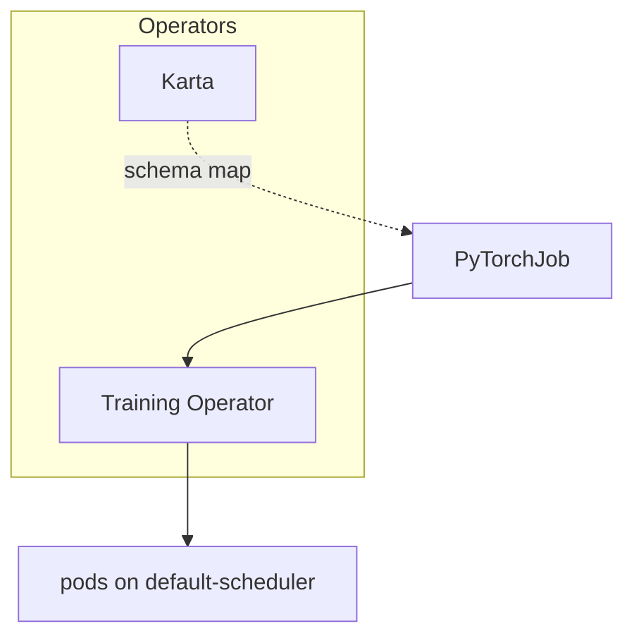
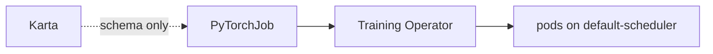

# Hands-on lab: Karta without KAI (decoupled scheduler)

**Why this lab exists:** prove Karta has no hard dependency on KAI — maps work with the cluster default scheduler alone.

This is a **step-by-step runthrough**. Paste the commands, check the expected result, then read what that step proves.

**Or run the verbose script** (opening banner + per-section “why / what you should see”):

```bash
./scripts/runthrough.sh
# INTERACTIVE=0 ./scripts/runthrough.sh
# SKIP_OPERATORS=1 ./scripts/runthrough.sh
```

Commands use `oc` (OpenShift); swap for `kubectl` if needed. See [README.md](README.md) for theory.

---

## What you will prove today

1. **Karta has no hard dependency on KAI.** Maps work with the cluster default scheduler.
2. A **PyTorchJob** (Training Operator) runs with empty/`default-scheduler` — never `kai-scheduler`.
3. Karta is schema translation only; **placement** stays with kube-scheduler (or optional Volcano — still not KAI).

---

## Tiny vocabulary

| Word | Plain meaning |
|------|----------------|
| **KAI** | Optional GPU topology / placement engine — **not installed here** |
| **Karta** | Declarative map of compound CRDs |
| **PyTorchJob** | Kubeflow Training Operator distributed-training CR |
| **EWI** | Optional Run:ai consumer of Karta maps (≠ KAI) |

---

## Setup and flow

Karta maps `PyTorchJob` while the Training Operator runs pods on `default-scheduler`. KAI is not installed — translation stays separate from placement.



---

## Before you start

```bash
cd examples/karta-decoupled-scheduler
pwd
```

**You need:** cluster, `helm`, `oc`/`kubectl`, cluster-admin. Training Operator install uses `oc apply -k` / `kubectl apply -k` (network to GitHub).

---

## Step 0 — Cluster access

```bash
oc whoami
oc get nodes
```

---

## Step 1 — Install operators **without KAI**

```bash
./scripts/install-operators.sh
```

Installs **Karta** and **Kubeflow Training Operator**. Never installs KAI.

Confirm KAI is absent:

```bash
oc get crd | grep -iE 'kai|gpuscheduling' || echo "no KAI CRDs — good"
oc get deploy -A | grep -i kai || echo "no KAI deployments"
```

**This shows:** The PoC stack does not pull a secondary GPU scheduler.

---

## Step 2 — Confirm operators

```bash
oc get pods -n karta-system
oc get crd pytorchjobs.kubeflow.org
oc get pods -n kubeflow 2>/dev/null || oc get deploy -A | grep -i training
# OpenShift AI may already run Training Operator here:
oc get pods,svc -n redhat-ods-applications 2>/dev/null | grep -i training || true
# Every Fail-policy PyTorchJob webhook must have endpoints (admission calls all of them):
oc get validatingwebhookconfiguration | grep -i training
oc get endpoints training-operator -n kubeflow 2>/dev/null || true
oc get endpoints kubeflow-training-operator -n redhat-ods-applications 2>/dev/null || true
```

**Do not proceed to helm** until webhook backends show IPs. A present CRD with `0 endpoints` will fail PyTorchJob CREATE.

---

## Step 3 — (Optional) Dry-run

```bash
helm template decoupled . | head -80
```

---

## Step 4 — Install this demo chart

```bash
helm upgrade --install decoupled . \
  -n decoupled --create-namespace
```

From repo root:

```bash
helm upgrade --install decoupled ./examples/karta-decoupled-scheduler \
  -n decoupled --create-namespace
```

Optional Ray path (needs KubeRay separately; still no KAI):

```bash
helm upgrade --install decoupled . -n decoupled --create-namespace \
  --set karta.rayJob.enabled=true --set rayJob.enabled=true
```

---

## Step 5 — Inventory

```bash
oc get karta
oc get pytorchjob -n decoupled
oc get pods -n decoupled
```

**Expected:** `kubeflow-org-pytorchjob-v1` Karta; `pytorchjob-default-scheduler` PyTorchJob; master/worker pods.

---

## Step 6 — Inspect the Karta map

```bash
oc get karta kubeflow-org-pytorchjob-v1 -o yaml | head -80
```

**This shows:** Schema for PyTorchJob master/worker — independent of which scheduler places pods.

---

## Step 7 — Prove default scheduler (not KAI)

```bash
oc get pods -n decoupled -o jsonpath='{range .items[*]}{.metadata.name}{"\t"}{.spec.schedulerName}{"\t"}{.status.phase}{"\n"}{end}'
```

**Expected:** Empty or `default-scheduler` — **never** `kai-scheduler`.

Optional PodGroup-style annotations (illustrative EWI contract):

```bash
oc get pytorchjob pytorchjob-default-scheduler -n decoupled -o jsonpath='{.metadata.annotations}' | python3 -m json.tool
```

---

## Step 8 — Clean up

```bash
helm uninstall decoupled -n decoupled
```

Optional: `helm uninstall karta -n karta-system` (Training Operator teardown is separate if you installed via kustomize).

---

## What you just saw



**Takeaway:** Red Hat AI can adopt Karta with a **different scheduler** than KAI. Placement ≠ translation.

---

## Troubleshooting

| Symptom | What to try |
|---------|-------------|
| Helm `--wait` stuck after `Pulled` | OpenShift: (1) SCC rejects chart UID `65532` (FailedCreate, no pods), or (2) OOMKilled at 128Mi. `Ctrl+C`; `oc get events,pods -n karta-system`; `helm uninstall karta -n karta-system` if status is failed/pending-*; re-run (scripts null UID/GID and set memory 512Mi) |
| `apply -k` fails | Network / GitHub access; retry; ensure `oc` or `kubectl` works |
| **`failed calling webhook ... training-operator ... no endpoints available`** | See recovery below — CRD/webhook exists but the Service has no ready pods |
| PyTorchJob pods Pending | Image pull / resources; SCC on OpenShift |
| **PyTorchJob pods OOMKilled** | Sample defaults to `busybox` + `sleep` at 64Mi (scheduler demo, not training). If you switched to a real PyTorch image (`kubeflowkatib/pytorch-mnist`), raise memory to ≥1Gi **or** keep the lightweight command. Training Operator often ignores in-place template changes — delete + recreate the job (see below). |
| Accidental KAI present | Unrelated installs — demo still valid if pods use default-scheduler |

### Recovery: PyTorchJob OOMKilled / stale pod template

Helm may patch the PyTorchJob CR, but the Training Operator often keeps the old pod template until recreate:

```bash
# After updating values.yaml (lighter image/command or higher memory):
helm upgrade --install decoupled . -n decoupled --create-namespace
oc delete pytorchjob pytorchjob-default-scheduler -n decoupled
helm upgrade --install decoupled . -n decoupled --create-namespace

# Confirm Running + default-scheduler:
oc get pods -n decoupled
oc get pods -n decoupled -o jsonpath='{range .items[*]}{.metadata.name}{"\t"}{.spec.schedulerName}{"\t"}{.status.phase}{"\n"}{end}'
```

### Recovery: PyTorchJob webhook has no endpoints

Helm CREATE hits every `failurePolicy: Fail` validating webhook. On OpenShift AI you often have **two**:

- ODS: `redhat-ods-applications/kubeflow-training-operator`
- Standalone (this lab): `kubeflow/training-operator`

If either has **0 endpoints**, install fails even when the other is healthy.

**1. Inspect**

```bash
oc get validatingwebhookconfiguration | grep -i training
oc get pods,svc,endpoints -n kubeflow
oc get pods,svc,endpoints -n redhat-ods-applications | grep -i training
oc get deploy -A | grep -i training
```

**2a. Preferred — wait / repair the backing operator**

```bash
# If standalone deploy exists but is not ready yet:
oc rollout status deployment/training-operator -n kubeflow --timeout=3m
oc get endpoints training-operator -n kubeflow   # must show an IP

# Or re-run the installer (waits for webhook endpoints; prefers ODS when healthy):
./scripts/install-operators.sh
```

**2b. OpenShift AI already healthy — remove orphaned standalone webhook only**

Use when ODS Training Operator is Running **and** `validator.training-operator.kubeflow.org` points at `kubeflow/training-operator` with **no** endpoints / no deploy:

```bash
oc get endpoints kubeflow-training-operator -n redhat-ods-applications   # must have IP
oc delete validatingwebhookconfiguration validator.training-operator.kubeflow.org
```

Do **not** delete `kubeflow-validator.training-operator.kubeflow.org` (ODS-owned).

**3. Retry the demo chart**

```bash
helm upgrade --install decoupled . -n decoupled --create-namespace
# or: SKIP_OPERATORS=1 ./scripts/runthrough.sh
```

---

## Next reading

- [README.md](README.md) — EWI vs KAI notes
- Sibling: [`../karta-openshift-workload-api`](../karta-openshift-workload-api) — Workload API as KAI alternative
