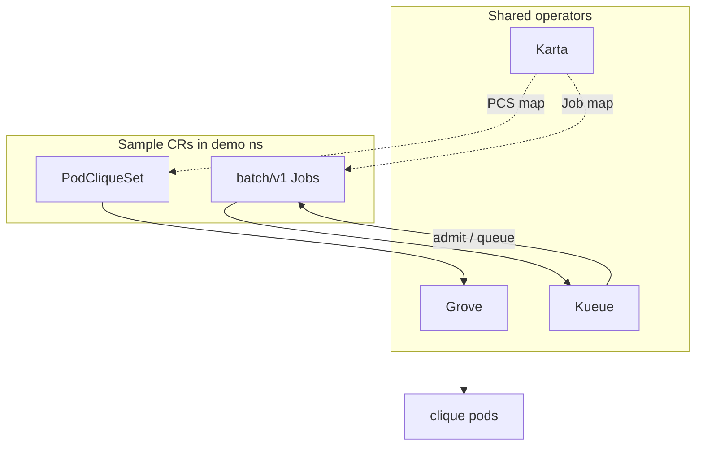
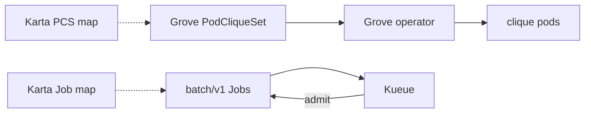

# Hands-on lab: Karta + Grove + Kueue

**Why this lab exists:** answer whether Grove topology, Kueue admission, and Karta maps can coexist on OpenShift without conflating their roles.

This is a **step-by-step runthrough**. Paste the commands, check the expected result, then read what that step proves.

**Or run the verbose script** (opening banner + per-section “why / what you should see”, pauses between sections):

```bash
./scripts/runthrough.sh
# INTERACTIVE=0 ./scripts/runthrough.sh          # no Enter pauses
# SKIP_OPERATORS=1 ./scripts/runthrough.sh       # operators already installed
```

You do **not** need prior Kubernetes experience beyond: you have a cluster, and you can run terminal commands.

Commands below use `oc` (OpenShift). If you use plain Kubernetes, swap `oc` for `kubectl` — the arguments are the same.

For deeper theory and file-by-file notes, see [README.md](README.md).

---

## What you will prove today

1. **Grove** runs a tiny multi-pod clique (`PodCliqueSet`) on `default-scheduler` — topology, not admission.
2. **Kueue** admits two sample `batch/v1` Jobs (generic + OpenShift-styled) through one LocalQueue.
3. **Karta** publishes two maps: one for Grove `PodCliqueSet`, one for `batch/v1` Job. One Job map covers both sample Jobs. Karta is not Grove and not Kueue.

---

## Tiny vocabulary

| Word | Plain meaning |
|------|----------------|
| **Grove** | Orchestrates multi-pod cliques (`PodCliqueSet` / `PodClique`) |
| **Kueue** | Admits jobs against quota; queues when the budget is full |
| **Karta** | Declarative map: “for this CRD kind, pods / status live here…” |
| **Helm** | Installs a package of YAML templates |

Full roles: [README.md](README.md#roles).

---

## Setup and flow

Operators install once; this chart only applies sample CRs. Grove owns clique topology, Kueue owns Job admission, Karta publishes schema maps for both kinds.



---

## Before you start

**You need:**

- An OpenShift or Kubernetes cluster
- `helm` and `oc` (or `kubectl`)
- Cluster-admin rights
- This folder as your working directory:

```bash
cd examples/karta-grove-kueue
pwd   # should end with .../karta-grove-kueue
```

**Honest expectations:** Grove pods should become Running (busybox). Sample Jobs should admit and complete when ClusterQueue quota is enough for both (default: CPU/memory budget covers both Jobs).

---

## Step 0 — Confirm you can talk to the cluster

```bash
oc whoami
oc get nodes
```

**Expected:** Your username and a node list.

**This shows:** API access works.

---

## Step 1 — Install Karta, Grove, and Kueue

```bash
./scripts/install-operators.sh
```

What the script does:

1. **Karta** into `karta-system`
2. **Grove** — installs into `grove-system` *or reuses* an existing `grove-operator` (e.g. Dynamo in `dynamo-platform`) to avoid Helm CRD/RBAC conflicts
3. **Kueue** into `kueue-system`

**Expected:** Helm finishes; script prints the example chart install command.

**This shows:** The three controllers are present. The example chart does **not** install them.

---

## Step 2 — Confirm operators are running

```bash
oc get pods -n karta-system
oc get pods -n kueue-system
# Grove may not be in grove-system if reused from Dynamo:
oc get deploy -A | grep grove-operator
```

**Expected:** Karta + Kueue pods `Running`; at least one ready `grove-operator` Deployment somewhere.

---

## Step 3 — (Optional) Dry-run

```bash
helm template demo . | head -80
```

**This shows:** Templated YAML without changing the cluster.

---

## Step 4 — Install this demo chart

```bash
helm upgrade --install demo . \
  -n demo --create-namespace
```

From repo root:

```bash
helm upgrade --install demo ./examples/karta-grove-kueue \
  -n demo --create-namespace
```

**Expected:** Helm `deployed`; NOTES list verify commands.

---

## Step 5 — Inventory

```bash
oc get karta
oc get podcliqueset -n demo
oc get clusterqueue demo-cluster-queue
oc get localqueue -n demo
oc get jobs -n demo
oc get pods -n demo
```

**Expected:**

| Object | Role |
|--------|------|
| `grove-kueue-podcliqueset-v1alpha1` | Karta map for Grove |
| `grove-kueue-batch-job-v1` | Karta map for every `batch/v1` Job |
| `grove-demo` | Grove `PodCliqueSet` |
| `demo-cluster-queue` / `demo-queue` | Kueue quota + namespace queue |
| `kueue-demo-job`, `openshift-batch-job` | Sample Jobs |

**This shows:** Grove path and Job path land together; they are independent (no Grove→Kueue wiring in this demo).

---

## Step 6 — Grove path (topology)

```bash
oc get podcliqueset grove-demo -n demo -o yaml | head -60
oc get pods -n demo -l grove.io/podcliqueset=grove-demo 2>/dev/null || oc get pods -n demo
oc get karta grove-kueue-podcliqueset-v1alpha1 -o yaml | head -80
```

**Expected:** Clique pods Running (or Creating→Running); Karta map points into PodCliqueSet structure.

**This shows:** Grove owns *how pods are grouped*. Karta only *describes* that shape for platforms.

---

## Step 7 — Kueue path (admission)

```bash
oc get workloads -n demo
oc get jobs -n demo
oc get localqueue -n demo
```

**Expected:** Workloads for both Jobs Admitted (quota is sized for both); Jobs unsuspend and complete.

**This shows:** Kueue owns *whether Jobs may start*. Same LocalQueue for both samples.

---

## Step 8 — One Job map covers OpenShift-style batch

```bash
oc get karta grove-kueue-batch-job-v1 -o yaml | head -80
oc get job openshift-batch-job -n demo -o yaml | grep -A5 'labels:\|app.openshift.io'
```

**Expected:** One `grove-kueue-batch-job-v1` Karta; `openshift-batch-job` has OpenShift-style labels but uses the same Job API.

**This shows:** Platforms do not need a separate Karta per Job name or label set.

---

## Step 9 — Clean up

```bash
helm uninstall demo -n demo
```

Optional — remove operators:

```bash
helm uninstall kueue -n kueue-system
helm uninstall grove-operator -n grove-system
helm uninstall karta -n karta-system
```

---

## What you just saw



**Takeaway:** Grove (topology), Kueue (admission), and Karta (schema maps) coexist. Karta does not replace Grove or Kueue.

---

## Troubleshooting

| Symptom | What to try |
|---------|-------------|
| Grove helm: CRD `.spec.versions` conflict / ClusterRole ownership (`release-name=dynamo`) | Cluster already has Grove (often Dynamo). Install script **reuses** it by default — re-run `./scripts/install-operators.sh`. Do **not** delete Dynamo Grove CRDs. |
| Helm upgrade: `conflict with "kueue" ... .spec.suspend` | Kueue owns Job suspend after admit. Delete sample Jobs, then upgrade: `oc delete job kueue-demo-job openshift-batch-job -n demo --ignore-not-found`; `helm upgrade --install demo . -n demo`. The runthrough script does this automatically. |
| Grove pods CrashLoop / scheduler errors | Confirm PodCliqueSet uses `schedulerName: default-scheduler` (chart sets this) |
| Jobs stay Suspended | `oc get workloads -n demo`; check ClusterQueue Active |
| Wrong directory | `cd` into `examples/karta-grove-kueue` |
| Helm: Karta / ResourceFlavor `exists and cannot be imported` / `meta.helm.sh/release-name` mismatch | Another demo owns the same cluster-scoped name. Defaults are chart-prefixed (`grove-kueue-*`). Uninstall the other release or override `--set karta.batchJob.name=...`. |

---

## Next reading

- [README.md](README.md) — roles, file guide, sibling examples
- Sibling: [`../karta-openshift-workload-api`](../karta-openshift-workload-api) — same stack + Workload API (bypass KAI)
