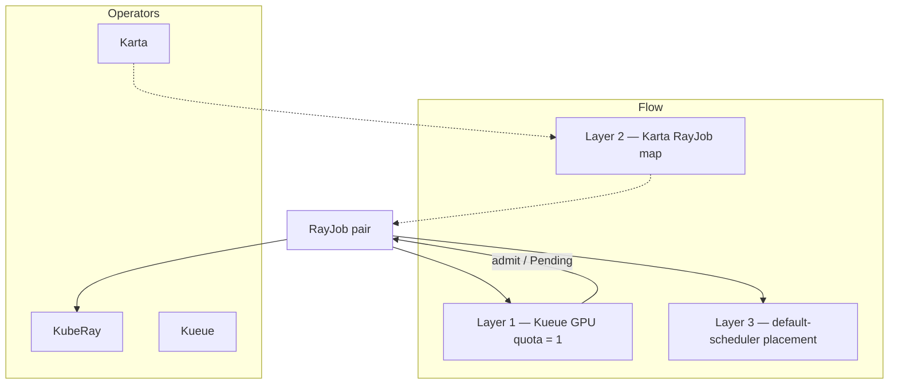
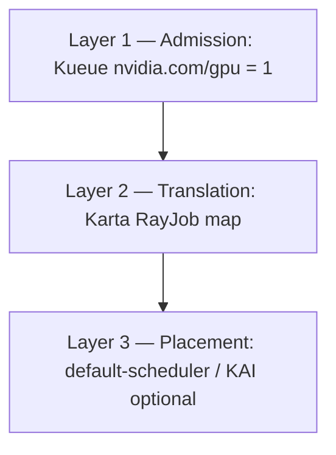

# Hands-on lab: Karta + Kueue admission (RayJob GPU quota)

**Why this lab exists:** with `nvidia.com/gpu` quota = 1, show Kueue admit-vs-queue for RayJobs while Karta stays a translation map.

This is a **step-by-step runthrough**. Paste the commands, check the expected result, then read what that step proves.

**Or run the verbose script** (opening banner + per-section “why / what you should see”):

```bash
./scripts/runthrough.sh
# INTERACTIVE=0 ./scripts/runthrough.sh
# SKIP_OPERATORS=1 ./scripts/runthrough.sh   # only if Karta + KubeRay + Kueue already Running
```

Commands use `oc` (OpenShift); swap for `kubectl` if needed. See [README.md](README.md).

---

## What you will prove today

1. **Kueue** admits RayJobs against a ClusterQueue with `nvidia.com/gpu` quota **1** → first job admits, second waits.
2. **Karta** maps `RayJob` (head/worker + PodGroup hints) independently of admission.
3. **Placement** (kube-scheduler / optional KAI) is a third layer — pods may stay Pending without real GPUs; admission still holds.

---

## Tiny vocabulary

| Word | Plain meaning |
|------|----------------|
| **Admission** | May this workload start under quota? (Kueue) |
| **Translation** | How to read the compound CRD (Karta) |
| **Placement** | Which node / device (scheduler) |

---

## Setup and flow

Three layers on the same RayJobs: Kueue admits against a 1-GPU quota (one runs, one waits), Karta maps the compound CRD, and the scheduler places pods when admitted.



---

## Before you start

```bash
cd examples/karta-kueue-admission
pwd
```

**Honest expectations:**

| Goal | Needs real GPUs? |
|------|------------------|
| See one Workload Admitted, one Pending | **No** (quota is enough) |
| See Ray pods Running with GPUs | **Yes** |

---

## Step 0 — Cluster access

```bash
oc whoami
oc get nodes
```

---

## Step 1 — Install Karta, KubeRay, and Kueue

```bash
./scripts/install-operators.sh
```

Kueue is installed with [`scripts/kueue-values.yaml`](scripts/kueue-values.yaml) so the **RayJob** framework is enabled.

```bash
oc get pods -n karta-system
oc get pods -n kueue-system
# KubeRay may be in ray-system or another namespace (OperatorHub / shared install)
oc get deploy -A | grep -iE 'kuberay|ray-operator'
oc get pods -n ray-system
```

---

## Step 2 — (Optional) Dry-run

```bash
helm template admit . | head -80
```

---

## Step 3 — Install this demo chart

```bash
helm upgrade --install admit . \
  -n admit --create-namespace
```

From repo root:

```bash
helm upgrade --install admit ./examples/karta-kueue-admission \
  -n admit --create-namespace
```

---

## Step 4 — Inventory

```bash
oc get karta admit-ray-io-rayjob-v1
oc get clusterqueue gpu-cluster-queue
oc get localqueue -n admit
oc get rayjob -n admit
```

**Expected:** RayJobs `rayjob-gpu-admit` and `rayjob-gpu-queued`.

---

## Step 5 — Quota is 1 GPU

```bash
oc get clusterqueue gpu-cluster-queue -o yaml | grep -A20 'nvidia.com/gpu\|nominalQuota\|coveredResources'
```

**Expected:** `nvidia.com/gpu` nominalQuota `"1"`.

**This shows:** Why the second RayJob must wait.

---

## Step 6 — Layer 1 — admit vs queue

```bash
oc get workloads -n admit
oc get rayjob -n admit
oc get localqueue -n admit
```

**Expected:** Roughly one Admitted / QuotaReserved and one Pending; second RayJob stays suspended while the first holds quota.

**This shows:** Kueue owns admission. No custom Ray↔Kueue Go bridge.

---

## Step 7 — Layer 2 — Karta map

```bash
oc get karta admit-ray-io-rayjob-v1 -o yaml | head -100
oc get rayjob -n admit -o jsonpath='{range .items[*]}{.metadata.name}{"\t"}{.metadata.labels.kueue\.x-k8s\.io/queue-name}{"\n"}{end}'
```

**This shows:** Translation (PodGroup-oriented contract) is separate from the queue label / admission path.

---

## Step 8 — Layer 3 — placement (optional reality check)

```bash
oc get pods -n admit -o wide
oc get pods -n admit -o jsonpath='{range .items[*]}{.metadata.name}{"\t"}{.spec.schedulerName}{"\t"}{.status.phase}{"\n"}{end}'
```

**Expected:** After admission, KubeRay may create pods. Without GPUs they can stay Pending — Layer 1 still valid.

---

## Step 9 — Free quota

```bash
oc delete rayjob rayjob-gpu-admit -n admit
oc get workloads -n admit
oc get rayjob -n admit
```

**Expected:** Queued Workload can move to Admitted after quota frees.

---

## Step 10 — Clean up

```bash
helm uninstall admit -n admit
```

Optional operators:

```bash
helm uninstall kueue -n kueue-system
helm uninstall kuberay-operator -n ray-system
helm uninstall karta -n karta-system
```

---

## What you just saw



**Takeaway:** Karta + Kueue work together on RayJob without a dedicated bridge. Sibling DRA demo swaps `nvidia.com/gpu` for DRA claims: [`../karta-kueue-dra`](../karta-kueue-dra).

---

## Troubleshooting

| Symptom | What to try |
|---------|-------------|
| Both jobs Pending / no Workloads | Confirm Kueue RayJob integration (`scripts/kueue-values.yaml`); re-run install |
| Both admit | Check ClusterQueue GPU quota is still `"1"` |
| Pods Pending forever | Expected without GPUs; focus on Workload Admitted/Pending |
| Helm: Karta `exists and cannot be imported` / `meta.helm.sh/release-name` mismatch | Another demo owns `admit-ray-io-rayjob-v1` (or a shared override). Uninstall that release or `--set karta.rayJob.name=...`. |

---

## Next reading

- [README.md](README.md) — KEP-6012 / CompositePodGroup framing
- [`../karta-kueue-dra`](../karta-kueue-dra) — same admit/queue story with DRA
