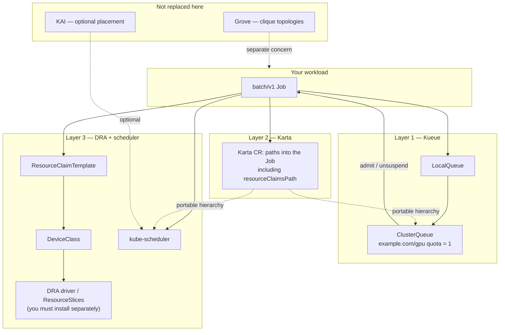

# Karta + Kueue + DRA — Explain Like You Are New

**Presentation:** open [`presentation/index.html`](presentation/index.html) (speaker notes with `?`). Overview: [`presentation/README.md`](presentation/README.md).

**Hands-on lab:** follow [karta-kueue-dra-runthrough.md](karta-kueue-dra-runthrough.md) for a beginner step-by-step deploy (what each step verifies and showcases).

**Karta CR walkthrough:** field-by-field notes for the Job map — [karta-batch-job.md](karta-batch-job.md).

**Verbose script:** from this directory run [`scripts/runthrough.sh`](scripts/runthrough.sh) (prints commands, checks, and pauses). Skip pauses with `INTERACTIVE=0`; skip operator reinstall with `SKIP_OPERATORS=1`.

**Teardown:** [`scripts/uninstall.sh`](scripts/uninstall.sh) removes the demo release, `dra-demo` namespace, and cluster-scoped demo CRs (`KEEP_OPERATORS=1` by default). Use [`scripts/uninstall-all.sh`](scripts/uninstall-all.sh) or `KEEP_OPERATORS=0` to also remove Karta/Kueue (`FORCE=1` skips the prompt).

This folder is a **demo Helm chart**. A Helm chart is a package of Kubernetes YAML files with fill-in-the-blank values. When you run `helm install`, Kubernetes gets real objects (Jobs, queues, device classes, and so on).

This demo answers one roadmap question in plain English:

> If we use **Kueue** to decide *whether a job may run* (admission / quota), and we use **DRA** to give the job a *real GPU* (device allocation), do we still need **Karta**?

**Short answer: yes.** Karta’s job is different from Kueue’s and DRA’s. Karta tells the platform *how to read* a compound workload (here: a normal Kubernetes `Job`) — including where the DRA GPU claims live in the YAML — without writing custom Go code for every CRD type.

This chart **does not** install Karta, Kueue, or a GPU driver by itself. You install those first (there is a script). This chart only creates the demo objects on top.

# Overview and Definitions

## What this demo shows (plain English)

Three different jobs working together — not one tool doing everything:

**Kueue (the queue / budget)**  
You only have 1 GPU slot in the budget. Two Jobs each want that slot. Kueue lets one start and makes the other wait. When the first is deleted, the second gets the slot. That’s fair sharing / admission control.

**Karta (the map)**  
Karta doesn’t decide who runs or hand out GPUs. It just says: “For this Job YAML, here’s where the pods are, here’s where the GPU claim is, here’s how suspend works.” So other tools can read any workload type the same way.

**DRA (the GPU ask)**  
Jobs don’t use the old `nvidia.com/gpu: 1` style here. They ask for a device through a ResourceClaim. Without a real GPU DRA driver, that claim can stay Pending — and that’s fine. The queue story still works.

**One-line takeaway:** On a Kueue + DRA roadmap you still want Karta — Kueue gates *who may run*, DRA is *how GPUs are claimed*, Karta is *how platforms understand the workload*.

---

## Vocabulary — products and projects in this story

Read this once. These names show up in tickets and sibling examples; only some are installed by **this** demo.

| Name | What it is (plain English) | Role vs this demo |
|------|----------------------------|-------------------|
| **Kueue** | Upstream Kubernetes project for **job queues and quotas**. It decides whether a workload may start *now* (admission) against a ClusterQueue budget (CPU, memory, logical GPUs). It does **not** pick the node or bind a physical GPU by itself. | **In this demo** — Layer 1. Quota `example.com/gpu = 1` so one Job admits and the second waits. |
| **Karta** (Workload-Map) | Declarative **schema map** for compound CRDs. One CR says “for this API kind, pods live at this path, DRA claims at that path, suspend is here…”. Platforms share one language without custom Go per CRD. Formerly associated with Run:ai; chart often still under `ghcr.io/run-ai/karta`. | **In this demo** — Layer 2. The `dra-batch-job-v1` Karta CR maps a normal `batch/v1` Job including DRA claim paths. Not a scheduler. |
| **DRA** | **Dynamic Resource Allocation** — Kubernetes API to claim devices (`DeviceClass`, `ResourceClaim`, `ResourceClaimTemplate`) instead of only extended resources like `nvidia.com/gpu: 1`. | **In this demo** — Layer 3 shape. Full bind needs a device driver; Pending claims still prove the layer split. |
| **Grove** | Project for **multi-pod clique topologies** (e.g. disaggregated LLM layouts: `PodCliqueSet` / `PodClique`). Models *how pods are grouped as an application*, not how to parse arbitrary CRDs. | **Not in this demo.** Sibling: [`../karta-grove-kueue`](../karta-grove-kueue). Different problem from Karta — Grove does **not** replace Karta. |
| **KAI** | **Kubernetes AI Scheduler** (NVIDIA / Run:ai lineage) — optional advanced **GPU topology / placement** engine (which GPUs, gang-aware placement, etc.). | **Not required here.** Sibling: [`../karta-decoupled-scheduler`](../karta-decoupled-scheduler) runs with default kube-scheduler and **no KAI**. Placement ≠ Karta’s map. |
| **Run:ai** | NVIDIA’s AI workload / GPU platform brand (often written **Run:ai**). Historically home to Karta, pieces of KAI scheduling, and enterprise GPU orchestration products. Org/repo names may still say `run-ai` even as open components move (e.g. workload-map). | **Context only.** This demo uses open Karta + upstream Kueue + Kubernetes DRA — not a full Run:ai product install. |
| **NVIDIA Dynamo** | NVIDIA’s framework / stack for **high-performance, disaggregated LLM inference** (serving graphs, workers, and related CRDs such as Dynamo graph deployments). Often discussed next to Grove-style multi-pod layouts. | **Not in this demo.** Karta can *map* Dynamo-style CRDs elsewhere; here we only map a plain Job + DRA. |

### How they fit together (mental model)

```
Your app YAML (Job, RayJob, Grove clique, Dynamo graph, …)
        │
        ▼
   Karta map ────────── “where are the pods / claims / suspend?”
        │
        ├──► Kueue ──── “may this start under quota?”     (admission)
        │
        └──► DRA + kube-scheduler
             (+ optional KAI)  “which device / which node?” (allocation + placement)

Grove / Dynamo ── describe multi-pod *application shape*
Karta ─────────── translate *any* CRD shape into a shared contract
```

**This folder only exercises:** Kueue + Karta + DRA on a `batch/v1` Job. Grove, KAI, Run:ai product, and Dynamo are defined so ticket language makes sense — they are not installed by the runthrough.

---

## Words you need before anything else

Read this section once. Everything below assumes these meanings.

| Word | What it is | What it is *not* |
|------|------------|------------------|
| **Kubernetes / OpenShift** | The cluster that runs containers as Pods | The AI training library itself |
| **Pod** | One or more containers scheduled onto a node | The Job object (a Job *creates* Pods) |
| **Job (`batch/v1`)** | A Kubernetes object that says “run this Pod once (or N times) then stop” | A queue, a GPU driver, or a scheduler plugin |
| **CRD** | Custom Resource Definition — a new API type the cluster understands (e.g. `Karta`, `ClusterQueue`) | A running program by itself |
| **Helm** | Tool that templates YAML and installs it | The scheduler |
| **Admission** | “May this workload start *now*, given our quotas?” | Actually placing the Pod on a node |
| **Placement / scheduling** | “Which node runs this Pod?” | Deciding if quota allows the Job to start |
| **Quota** | A budget of CPU, memory, GPUs the queue may use | A physical GPU sitting in a server |
| **Kueue** | Kubernetes project that queues Jobs and admits them against ClusterQueue quotas | A GPU allocator; not Karta |
| **DRA** | Dynamic Resource Allocation — Kubernetes API for claiming devices (GPUs, etc.) via `ResourceClaim` / `DeviceClass` instead of only `nvidia.com/gpu: 1` | Kueue; not Karta |
| **DeviceClass** | Named “kind of device” (e.g. `gpu.example.com`) that claims request | The driver binary that talks to the GPU |
| **ResourceClaimTemplate** | Recipe: “for each Pod, create a claim for N devices of this DeviceClass” | The queue |
| **ResourceClaim** | The concrete “I need this device” object created from the template for a Pod | Quota accounting (that is Kueue) |
| **Karta** | Declarative **map**: “for this CRD kind, the pods are at this JSON path, DRA claims at that path, suspend field is here…” | A scheduler; not Grove; not KAI |
| **PodGroup (concept)** | A logical group of pods that belong together for gang / hierarchy views | Always a specific CRD name in this demo (Karta *describes* the grouping) |
| **Grove** | Separate project for multi-pod **clique topologies** (disaggregated LLM layouts) | Replaced by Karta — **no**, different problem |
| **KAI** | Optional advanced GPU **topology placement** engine | Required for this demo — **no** |
| **Run:ai** | NVIDIA AI platform brand; historical home of Karta / related GPU orchestration | Required product install for this demo — **no** |
| **NVIDIA Dynamo** | Disaggregated LLM inference stack / related workload CRDs | Part of this chart — **no** |
| **kube-scheduler** | Default Kubernetes scheduler that places Pods on nodes | Kueue (admission) or DRA (device binding) |
| **ClusterQueue** | Cluster-wide Kueue budget (CPU + memory + logical GPUs) | A namespace |
| **LocalQueue** | Namespace entrypoint; Jobs point at it with a label | Where GPUs physically live |
| **ResourceFlavor** | Named capacity pool Kueue uses inside a ClusterQueue (optionally tied to node labels) | A DeviceClass |
| **`example.com/gpu`** | **Logical** quota name Kueue counts (configured via `deviceClassMappings`) | The DeviceClass name (`gpu.example.com`) — related but not the same string |
| **Suspend** | Job field `spec.suspend: true` means “do not create Pods yet” | Failed job |

### Three layers this demo stacks (memorize this)

```
Layer 1 — ADMISSION (Kueue)
  “Do we have free example.com/gpu quota? If yes, unsuspend the Job. If no, keep it waiting.”

Layer 2 — TRANSLATION (Karta)
  “Here is a portable map of the Job CRD: where pods live, where DRA claims live,
   how to read status, how to suspend/resume. Platforms share one language.”

Layer 3 — DEVICE ALLOCATION + PLACEMENT (DRA + kube-scheduler)
  “Create a ResourceClaim from the template, bind a real device, put the Pod on a node.”
```

**Order that matters for a running Job:**

1. You create a Job labeled for a Kueue LocalQueue, with `suspend: true`, and with DRA `resourceClaims` on the pod template.
2. **Kueue** checks ClusterQueue quota. If free → admits → sets suspend false (Job may create Pods). If not free → Workload stays Pending; Job stays suspended.
3. **Karta** does not admit and does not allocate GPUs. It only publishes the map so tools/platforms know how to interpret the Job (including DRA paths).
4. When Pods are created, **DRA** + **kube-scheduler** try to allocate devices and place Pods. That needs DRA APIs on the cluster **and** a real device driver for full success.

**What works without a real GPU driver:** Kueue admit-vs-queue, and inspecting the Karta map.  
**What needs a DRA driver + DRA-enabled cluster:** ResourceClaims that become Allocated/Bound and Pods that actually run with devices.

---

## How this example differs from siblings

| Folder | What it proves |
|--------|----------------|
| [`../karta-grove-kueue`](../karta-grove-kueue) | Grove clique topologies + Karta + Kueue |
| [`../karta-kueue-admission`](../karta-kueue-admission) | RayJob + classic `nvidia.com/gpu` quota (old extended-resource style) |
| **This folder (`karta-kueue-dra`)** | Plain `batch/v1` Job + **DRA** `ResourceClaimTemplate` + Kueue counting DRA via `deviceClassMappings` |
| [`../karta-decoupled-scheduler`](../karta-decoupled-scheduler) | Karta with default kube-scheduler and **no KAI** |

---

## Ticket answers (no interpretation left)

### 1. Why both Grove and Karta?

They fix **different layers**. Using both is not double work.

| Component | Owns | Does **not** own |
|-----------|------|------------------|
| **Grove** | Application **clique topologies** (`PodCliqueSet` / `PodClique`) for multi-pod layouts | Translating arbitrary CRD schemas; cluster-wide GPU quota admission |
| **Karta** | Declarative **schema maps** so platforms read compound CRDs the same way | Building clique topologies; replacing Grove |
| **KAI** | Advanced **GPU topology placement** | Being Grove’s app model or Karta’s maps |

KAI scheduling Grove topologies answers a **placement** question. It does **not** make Karta useless. Karta’s value is portable CRD → PodGroup-like contract so admission (Kueue) and placement (kube-scheduler / DRA / optional KAI) share one hierarchy language.

### 2. Can Karta replace Grove?

**No.** Grove owns multi-pod clique structure. Karta maps CRDs (here: `Job`, including DRA claim paths). Different jobs.

### 3. Does this work with Kueue?

**Yes.** Sample Jobs have label `kueue.x-k8s.io/queue-name: dra-local-queue`. Kueue admits them against ClusterQueue quota for logical resource `example.com/gpu` (wired in [`scripts/kueue-values.yaml`](scripts/kueue-values.yaml) via `deviceClassMappings`). Quota is **1**. Each Job wants **1** DRA GPU → first admits, second stays **Pending** until the first releases quota.

### 4. Is Karta still useful on a Kueue + DRA roadmap?

**Yes — as the compound-CRD translation layer.** Kueue = admission. DRA + kube-scheduler = devices + placement. Grove = cliques (separate). KAI = optional advanced GPU topology. None of those replace Karta’s map.



---

## What this chart creates (exact objects)

After `helm install`, you get:

| Name | Kind | Layer | Purpose in one sentence |
|------|------|-------|-------------------------|
| `dra-batch-job-v1` | `Karta` | 2 | Map of how to read `batch/v1` Job (pods, DRA claims, suspend, status) |
| `dra-gpu-flavor` | `ResourceFlavor` | 1 | Named capacity pool for the ClusterQueue |
| `dra-cluster-queue` | `ClusterQueue` | 1 | Budget: CPU 4, memory 8Gi, **example.com/gpu: 1** |
| `dra-local-queue` | `LocalQueue` | 1 | Namespace queue Jobs select with a label |
| `gpu.example.com` | `DeviceClass` | 3 | Illustrative device type (fake for demos unless you point at a real driver) |
| `single-gpu` | `ResourceClaimTemplate` | 3 | “Each Pod claims exactly 1 device of class `gpu.example.com`” |
| `dra-job-admit` | `Job` | app | First Job: wants 1 DRA GPU → should get admitted |
| `dra-job-queued` | `Job` | app | Second Job: also wants 1 DRA GPU → should stay queued |

All names come from [`values.yaml`](values.yaml). Change them there, not by hand-editing rendered YAML.

---

## File guide (every file, no guessing)

| File | What it does |
|------|----------------|
| [`Chart.yaml`](Chart.yaml) | Helm metadata: chart name `karta-kueue-dra`, version `0.1.0`. Not installed operators. |
| [`values.yaml`](values.yaml) | Knobs: enable/disable Karta/Kueue/DRA, quota numbers, DeviceClass name, the two sample Jobs (image, CPU, memory, sleep commands). |
| [`templates/_helpers.tpl`](templates/_helpers.tpl) | Helm name/label helpers only. No cluster behavior. |
| [`templates/NOTES.txt`](templates/NOTES.txt) | Text Helm prints after install (quick `oc get` reminders). |
| [`templates/karta-batch-job.yaml`](templates/karta-batch-job.yaml) | Creates the `Karta` CR. Tells platforms: Job pods at `.spec.template`, DRA claims at `.spec.template.spec.resourceClaims`, suspend at `.spec.suspend`, etc. Field-by-field walkthrough: [`karta-batch-job.md`](karta-batch-job.md). |
| [`templates/kueue-resourceflavor.yaml`](templates/kueue-resourceflavor.yaml) | Creates `ResourceFlavor` `dra-gpu-flavor`. Empty node labels = any node (fine for demos). |
| [`templates/kueue-clusterqueue.yaml`](templates/kueue-clusterqueue.yaml) | Creates `ClusterQueue` with covered resources `cpu`, `memory`, `example.com/gpu` and nominalQuota GPU **1**. |
| [`templates/kueue-localqueue.yaml`](templates/kueue-localqueue.yaml) | Creates `LocalQueue` `dra-local-queue` pointing at that ClusterQueue. |
| [`templates/dra-deviceclass.yaml`](templates/dra-deviceclass.yaml) | Creates illustrative `DeviceClass` `gpu.example.com` if `dra.createDeviceClass: true`. On real clusters, set that to `false` and use the vendor DeviceClass. |
| [`templates/dra-resourceclaimtemplate.yaml`](templates/dra-resourceclaimtemplate.yaml) | Creates `ResourceClaimTemplate` `single-gpu` requesting 1 device of that DeviceClass. |
| [`templates/sample-job.yaml`](templates/sample-job.yaml) | Creates both Jobs. Each: Kueue queue label, `suspend: true`, DRA `resourceClaims` + container `claims`, OpenShift-restricted securityContext. |
| [`scripts/install-operators.sh`](scripts/install-operators.sh) | Installs **Karta** and **Kueue** with the DRA mapping values file. Does **not** install a GPU DRA driver. |
| [`scripts/kueue-values.yaml`](scripts/kueue-values.yaml) | Kueue install config: enable `batch/job` integration; map DeviceClass `gpu.example.com` → logical quota name `example.com/gpu`. |
| [`scripts/runthrough.sh`](scripts/runthrough.sh) | Optional verbose hands-on script (pauses / checks). |
| [`scripts/uninstall-all.sh`](scripts/uninstall-all.sh) | Optional teardown helper. |
| [`presentation/`](presentation/) | HTML slideshow (findings + roadmap). |
| [`karta-kueue-dra-runthrough.md`](karta-kueue-dra-runthrough.md) | Optional beginner step-by-step lab. |
| [`karta-batch-job.md`](karta-batch-job.md) | Optional field-by-field Karta CR walkthrough. |

### Critical name wiring (easy to break if you rename one side only)

These three must stay consistent:

1. **DeviceClass** metadata name → default `gpu.example.com` (`values.yaml` → `dra.deviceClass.name`)
2. **Kueue** `deviceClassMappings.deviceClassNames` → must list that same name ([`scripts/kueue-values.yaml`](scripts/kueue-values.yaml))
3. **Kueue** logical quota name → `example.com/gpu` in both `deviceClassMappings.name` **and** ClusterQueue `coveredResources` / `nominalQuota`

If those disagree, Kueue will not account for DRA claims the way this demo expects.

---

## Prerequisites

### Always (to see admit vs queue)

- An OpenShift or Kubernetes cluster
- `helm` and `oc` (or `kubectl`)
- Cluster-admin (operators + cluster-scoped CRs: `Karta`, `ClusterQueue`, `DeviceClass`, …)
- Karta + Kueue installed with the DRA mappings (use the install script)

### Extra (to see real devices bind)

| Need | Why |
|------|-----|
| DRA APIs (`resource.k8s.io` DeviceClass / ResourceClaim / ResourceClaimTemplate) | Without them the DRA objects will not work |
| Prefer `resource.k8s.io/v1` | GA on recent Kubernetes; older clusters may only have beta |
| A **DRA device driver** that publishes ResourceSlices | Without it, claims stay Pending even after Kueue admits the Job |
| Kueue ≥ 0.18 (0.19+ recommended) | DRA ResourceClaimTemplate accounting path; restart Kueue after changing `deviceClassMappings` |
| Honest DeviceClass | Chart’s `gpu.example.com` is a **demo shape**. Production: `dra.createDeviceClass: false` and point claims at the real class (e.g. vendor `gpu.nvidia.com`) |

OpenShift DRA GPU support is still evolving; confirm CRDs exist on your target release before expecting bound claims.

Prefer **podman** over docker if you build or pull driver-related images locally.

---

## 1. Install operators (Karta + Kueue only)

From this chart directory, or adjust paths from the repo root.

```bash
./scripts/install-operators.sh
```

What that script does, exactly:

1. `helm upgrade --install karta` from `oci://ghcr.io/run-ai/karta/karta` version `0.2.0` into namespace `karta-system`, with `podSecurityContext.runAsUser` / `runAsGroup` nulled (OpenShift restricted SCC — chart default UID `65532` is rejected) and memory raised to `512Mi` (chart default `128Mi` OOMKills on CRD-heavy clusters)
2. `helm upgrade --install kueue` from `oci://registry.k8s.io/kueue/charts/kueue` version `0.19.5` into `kueue-system`, with `-f scripts/kueue-values.yaml` (top-level `managerConfig.controllerManagerConfigYaml` + `deviceClassMappings`)

Manual equivalent:

```bash
helm upgrade --install karta oci://ghcr.io/run-ai/karta/karta \
  --version 0.2.0 -n karta-system --create-namespace --wait \
  --set podSecurityContext.runAsUser=null \
  --set podSecurityContext.runAsGroup=null \
  --set resources.requests.memory=128Mi \
  --set resources.limits.memory=512Mi

helm upgrade --install kueue oci://registry.k8s.io/kueue/charts/kueue \
  --version 0.19.5 -n kueue-system --create-namespace --wait \
  -f ./examples/karta-kueue-dra/scripts/kueue-values.yaml
```

Confirm DRA mapping is live (Workloads stay Inadmissible if this is missing):

```bash
oc get cm kueue-manager-config -n kueue-system -o yaml | grep -A8 deviceClassMappings
```

Optional next: install your cluster’s GPU DRA driver from vendor docs. This repo does not ship that driver.

---

## 2. Install this example chart

From this chart directory:

```bash
helm upgrade --install dra-demo . -n dra-demo --create-namespace
```

From repo root (`run-ai-karta`):

```bash
helm upgrade --install dra-demo ./examples/karta-kueue-dra \
  -n dra-demo --create-namespace
```

**Expected:** Helm reports `deployed` and prints NOTES (layers + quick `oc get` reminders).

**What this shows:** Demo CRs only — queues, DeviceClass, claim template, Karta map, two Jobs. Operators must already be running.

Dry-run (render YAML without applying):

```bash
helm template dra-demo ./examples/karta-kueue-dra | head -100
```

---

## 3. Walkthrough — what each check shows

Use `oc` below (`kubectl` is fine with the same args). After install, give Kueue a few seconds to create Workloads.

For a beginner, numbered lab, see also [karta-kueue-dra-runthrough.md](karta-kueue-dra-runthrough.md).

### 0. Inventory — did the chart land?

```bash
oc get karta dra-batch-job-v1
oc get clusterqueue dra-cluster-queue
oc get localqueue -n dra-demo
oc get deviceclass gpu.example.com
oc get resourceclaimtemplate -n dra-demo
oc get jobs -n dra-demo
```

| Object | Expected | What it shows |
|--------|----------|----------------|
| `dra-batch-job-v1` | Exists (framework Job) | Layer 2 map is installed |
| `dra-cluster-queue` / `dra-local-queue` | Exist | Layer 1 queues exist |
| `gpu.example.com` / `single-gpu` | Exist | Layer 3 DeviceClass + claim recipe exist |
| `dra-job-admit`, `dra-job-queued` | Both present; often `Suspended` at first | App workloads opt into the LocalQueue |

If any of these are missing, re-check Helm release: `helm status dra-demo -n dra-demo`.

---

### A. ClusterQueue quota — why only one Job can run

```bash
oc get clusterqueue dra-cluster-queue -o yaml | grep -A20 'nominalQuota\|coveredResources\|example.com/gpu'
```

**Expected:**

- `coveredResources` includes `cpu`, `memory`, and `example.com/gpu`
- `nominalQuota` for `example.com/gpu` is `"1"`
- ClusterQueue condition often `Active` / “Can admit new workloads”

**What this shows:** The entire admit-vs-queue demo hinges on **quota = 1**. Each sample Job wants 1 DRA GPU unit, so only one Workload can hold quota at a time.

Also confirm Kueue knows how to count that DeviceClass (if this is empty, Workloads stay Inadmissible):

```bash
oc get cm kueue-manager-config -n kueue-system -o yaml | grep -A8 deviceClassMappings
```

**Expected:** `name: example.com/gpu` and `deviceClassNames: [gpu.example.com]`.

---

### B. Kueue admission — one in, one waiting (Layer 1)

```bash
oc get localqueue -n dra-demo
oc get workloads -n dra-demo
oc get jobs -n dra-demo
```

**Expected (happy path):**

| View | What you should see |
|------|---------------------|
| LocalQueue | Roughly `PENDING WORKLOADS: 1`, `ADMITTED WORKLOADS: 1` |
| Workloads | One with `ADMITTED=True` (and `RESERVED IN: dra-cluster-queue`); one blank / not admitted |
| Jobs | Admitted Job leaves `Suspended` (often shows `Running`); queued Job stays `Suspended` |

Drill into *why* the waiter is waiting:

```bash
oc describe workload -n dra-demo | grep -A2 'insufficient\|Admitted\|QuotaReserved\|Inadmissible'
```

**Expected messages:**

- **Admitted Workload:** `QuotaReserved=True`, `Admitted=True` (e.g. “Admitted by ClusterQueue dra-cluster-queue”)
- **Queued Workload:** `insufficient unused quota for example.com/gpu … 1 more needed`
- **Bad config (fix before demo):** `DeviceClass gpu.example.com is not mapped in DRA configuration` → re-install Kueue with [`scripts/kueue-values.yaml`](scripts/kueue-values.yaml)

**What this shows:** Kueue owns *whether* the Job may start. No GPU DRA driver required. Job *names* (`dra-job-admit` vs `dra-job-queued`) are labels for the happy path; if you recreate Jobs or delete one early, **whichever Workload got quota first** is the “admitted” one — look at `ADMITTED` / Job status, not only the name.

Optional detail:

```bash
oc get workloads -n dra-demo -o wide
oc describe job dra-job-admit -n dra-demo | head -40
oc describe job dra-job-queued -n dra-demo | head -40
```

Confirm both Jobs have label `kueue.x-k8s.io/queue-name=dra-local-queue` and started with `Suspend: true`.

---

### C. Karta map — translation only (Layer 2)

```bash
oc get karta dra-batch-job-v1 -o yaml
```

**Expected in `spec`:**

| Field area | Look for | Meaning |
|------------|----------|---------|
| Root kind | `batch` / `Job` / `v1` | This map is for classic Jobs |
| Pod template | `podTemplateSpecPath: .spec.template` | Where the Pod lives |
| DRA claims | `resourceClaimsPath: .spec.template.spec.resourceClaims` | Where DRA claims are declared |
| Suspend | `suspendDefinition` → `.spec.suspend` | How to pause/resume the Job |
| Gang hint | `gangScheduling.podGroups` | Logical grouping for platforms |

**Status note:** You may see `Validated=False` / `Ready=False` with a message like “multiple pod spec definitions” depending on Karta version. The map content above is still what the demo is teaching; admission (section B) does not depend on Karta Ready.

**What this shows:** Karta does **not** admit Jobs and does **not** allocate GPUs. It publishes a portable schema map so tools share one language for compound CRDs — including DRA claim paths. That is why Karta stays useful on a Kueue + DRA roadmap.

---

### D. DRA objects and pods — device layer (Layer 3)

```bash
oc get deviceclass
oc get resourceclaimtemplate -n dra-demo
oc get resourceclaim -n dra-demo
oc get pods -n dra-demo -o wide
```

**Expected:**

| Object | Without GPU DRA driver | With DRA APIs + real driver |
|--------|------------------------|-----------------------------|
| DeviceClass `gpu.example.com` | Present (demo shape) | Prefer vendor class; set `dra.createDeviceClass: false` |
| ResourceClaimTemplate `single-gpu` | Present | Present |
| ResourceClaim / Pod | May appear after admit; often **Pending** | Allocate / Bound; Pod can run with device |

**What this shows:** DRA + kube-scheduler own *devices and placement*. Pending claims/pods **do not** mean Layer 1 failed — they prove the layers are separate. Full bind needs a driver that publishes ResourceSlices for this DeviceClass.

---

### E. Free quota — prove admission is dynamic

Delete the Job that currently holds quota (the non-suspended / Admitted one). On a fresh install that is usually `dra-job-admit`; after a recreate or earlier delete it may be `dra-job-queued`.

```bash
oc get jobs -n dra-demo
oc get workloads -n dra-demo

# Delete whichever Job is admitted / Running (example: dra-job-admit)
oc delete job dra-job-admit -n dra-demo
oc get workloads -n dra-demo -w
```

Press `Ctrl+C` when the waiting Workload flips to Admitted.

Then:

```bash
oc get jobs -n dra-demo
oc get workloads -n dra-demo
oc get localqueue -n dra-demo
```

**Expected:**

1. Deleted Job’s Workload goes away and releases `example.com/gpu`
2. Previously pending Workload gets `RESERVED IN: dra-cluster-queue` and `ADMITTED: True` (often within a second or two)
3. That Job unsuspends (may show `Running`); its Pod/claim may still be Pending without a driver

**What this shows:** Live Layer 1 behavior — admission is quota-driven and continuous, not a one-time label check at create time.

---

### Quick “did the demo succeed?” checklist

| Proof | Command hint | Pass if… |
|-------|----------------|----------|
| Quota is 1 | ClusterQueue YAML | `example.com/gpu` nominalQuota `"1"` |
| Mapping live | `kueue-manager-config` | `deviceClassMappings` present |
| One admitted, one queued | `oc get workloads` / `localqueue` | 1 admitted + 1 pending (or pending message “1 more needed”) |
| Karta maps DRA path | `oc get karta … -o yaml` | `resourceClaimsPath` set |
| Layers separate | pods/claims Pending OK | Admission worked even if devices did not bind |
| Quota release works | delete admitted Job + `-w` | Waiter becomes Admitted |

## What each sample Job contains (so the YAML is not magic)

Both Jobs are almost identical. Differences are only name and the sleep/echo command in [`values.yaml`](values.yaml).

Each Job has:

1. **Label** `kueue.x-k8s.io/queue-name: dra-local-queue`  
   → “Please manage me with Kueue via that LocalQueue.”

2. **`spec.suspend: true`**  
   → “Do not create Pods until Kueue admits me.”

3. **`spec.template.spec.resourceClaims`**  
   → “Build a claim from template `single-gpu`.”

4. **Container `resources.claims`**  
   → “Attach that claim to this container” (DRA style — **not** `nvidia.com/gpu: 1`).

5. **Annotation** `karta.run.ai/podgroup-name`  
   → Hint correlating the Job with a PodGroup-style view from the Karta contract.

6. **OpenShift restricted securityContext** when `openshiftRestricted: true`  
   → Non-root, drop capabilities, RuntimeDefault seccomp — so the Job can run under restricted SCC.

---

## Uninstall

Full teardown (demo chart, `dra-demo` namespace, cluster-scoped demo CRs, and Karta/Kueue operators):

```bash
./scripts/uninstall-all.sh
# FORCE=1 ./scripts/uninstall-all.sh           # skip confirmation
# KEEP_OPERATORS=1 ./scripts/uninstall-all.sh  # remove demo only
```

Manual equivalent:

```bash
helm uninstall dra-demo -n dra-demo
# optional — remove operators too
# helm uninstall kueue -n kueue-system
# helm uninstall karta -n karta-system
```

---

## Roadmap takeaway (one paragraph)

On a **Kueue + DRA** roadmap, **Karta stays useful** as the layer that translates compound CRDs into a shared PodGroup-like contract (including DRA claim paths). **Kueue** owns whether the Job may start under quota. **DRA + kube-scheduler** own devices and node placement. **Grove** still owns clique topologies. **KAI** remains optional for advanced GPU topology — it is **not** a prerequisite for Karta’s value, and this demo intentionally runs placement without requiring KAI.
