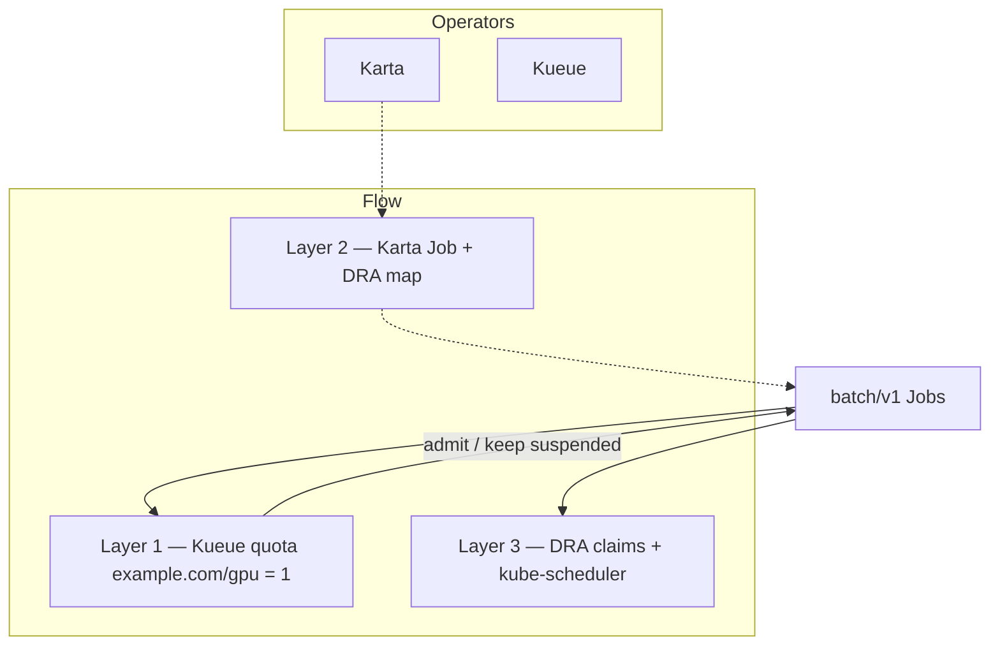
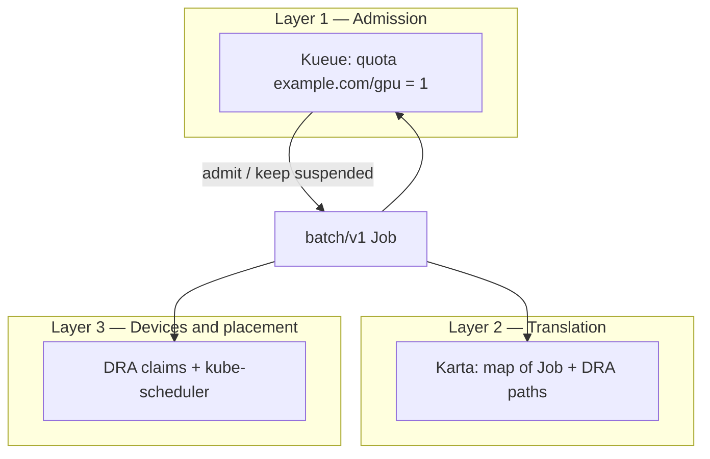

# Hands-on lab: Karta + Kueue + DRA

**Why this lab exists:** show Kueue admit-vs-queue for DRA GPU claims while Karta only maps Job + claim paths — even without a real GPU driver.

This is a **step-by-step runthrough**. Paste the commands, check the expected result, then read what that step proves.

**Or run the verbose script** (opening banner + per-section “why / what you should see”, pauses between sections):

```bash
./scripts/runthrough.sh
# INTERACTIVE=0 ./scripts/runthrough.sh          # no Enter pauses
# SKIP_OPERATORS=1 ./scripts/runthrough.sh       # operators already installed
```

You do **not** need prior Kubernetes experience beyond: you have a cluster, and you can run terminal commands.

Commands below use `oc` (OpenShift). If you use plain Kubernetes, swap `oc` for `kubectl` — the arguments are the same. Prefer **podman** over docker if you pull or build images locally.

For deeper theory, glossary, and file-by-file notes, see [README.md](README.md).

---

## What you will prove today

1. **Kueue** decides *whether* a job may start: with GPU quota set to **1**, the first job is admitted and the second waits in line.
2. **Karta** is a *map* of how to read a Job (including where DRA GPU claims live in the YAML). It is not a scheduler and not a queue.
3. **DRA** is how the Job *asks for a real GPU*. Full device binding needs a DRA driver on the cluster; the admit-vs-queue story works even without one.

---

## Tiny vocabulary

| Word | Plain meaning |
|------|----------------|
| **Cluster** | The group of machines OpenShift/Kubernetes controls |
| **Pod** | One or more containers scheduled onto a node |
| **Job** | An object that says “run this Pod, then stop” |
| **Helm** | A tool that installs a package of YAML templates |
| **Quota** | A budget (here: how many logical GPUs the queue may use) |
| **Kueue** | Admits jobs against quota; queues them when the budget is full |
| **DRA** | Dynamic Resource Allocation — claim a device (GPU) via ResourceClaims |
| **Karta** | Declarative map: “for this Job type, pods are here, DRA claims are there…” |

Full glossary: [README.md](README.md#words-you-need-before-anything-else).

---

## Setup and flow

Same admit/queue story as the RayJob admission demo, but the sample uses `batch/v1` Jobs with DRA claims. Kueue owns quota; Karta maps Job + DRA paths; DRA + kube-scheduler own devices and placement.



---

## Before you start

**You need:**

- An OpenShift or Kubernetes cluster
- `helm` and `oc` (or `kubectl`) on your machine
- Cluster-admin rights (you will install operators and cluster-scoped objects)
- This folder as your working directory:

```bash
cd examples/karta-kueue-dra
# Or from repo root: cd run-ai-karta/examples/karta-kueue-dra
pwd   # should end with .../karta-kueue-dra
```

**Honest expectations:**

| Goal | Needs a real GPU DRA driver? |
|------|------------------------------|
| See one Job admitted, one queued | **No** |
| Inspect the Karta map | **No** |
| See ResourceClaims become Allocated/Bound and Pods run with devices | **Yes** (plus DRA APIs on the cluster) |

This chart’s DeviceClass (`gpu.example.com`) is a **demo shape**. Production clusters use the vendor’s DeviceClass. Details: [README prerequisites](README.md#prerequisites).

---

## Step 0 — Confirm you can talk to the cluster

**Goal:** Make sure your CLI is logged in and the cluster responds.

```bash
oc whoami
oc get nodes
```

**Expected:** Your username prints, and a list of nodes appears (STATUS often `Ready`).

**This shows:** Your credentials and API access work. If this fails, fix login before continuing.

---

## Step 1 — Install Karta and Kueue (operators)

**Goal:** Install the platforms this demo sits on. The example chart does **not** install them; this script does.

```bash
./scripts/install-operators.sh
```

What the script does:

1. Installs **Karta** (`oci://ghcr.io/run-ai/karta/karta` `0.2.0`) into `karta-system`, with `runAsUser`/`runAsGroup` cleared so OpenShift restricted SCC can assign a project UID
2. Installs **Kueue** into `kueue-system`, with DRA accounting from [`scripts/kueue-values.yaml`](scripts/kueue-values.yaml) (DeviceClass `gpu.example.com` → logical quota name `example.com/gpu`)

**Expected:** Helm finishes with both releases installed; the script prints a reminder to install the example chart next. Takes a few minutes (`--wait`).

**This shows:** Layer 1 (Kueue admission) and Layer 2 (Karta map platform) are present. It does **not** install a GPU DRA driver.

After install, confirm the DRA mapping actually landed (wrong Helm key = mapping silently missing):

```bash
oc get cm kueue-manager-config -n kueue-system -o yaml | grep -A8 deviceClassMappings
```

**Expected:** You see `example.com/gpu` and `gpu.example.com`.

---

## Step 2 — Confirm the operators are running

**Goal:** Verify the pods behind those installs are healthy.

```bash
oc get pods -n karta-system
oc get pods -n kueue-system
```

**Expected:** Pods in both namespaces show `Running` (and ready, e.g. `1/1`).

**This shows:** The admission controller (Kueue) and the Karta platform are up before you create demo workloads.

---

## Step 3 — (Optional) Dry-run: render the chart without installing

**Goal:** See the YAML Helm would create, without changing the cluster.

```bash
helm template dra-demo . | head -80
```

**Expected:** YAML documents scroll by (Jobs, queues, DeviceClass snippets, etc.).

**This shows:** A Helm chart is templated YAML. Safe to inspect before you apply anything.

---

## Step 4 — Install this demo chart

**Goal:** Create the showcase objects: Karta map, Kueue queues, DRA DeviceClass + claim template, and two sample Jobs.

From this directory (`examples/karta-kueue-dra`):

```bash
helm upgrade --install dra-demo . \
  -n dra-demo --create-namespace
```

From the `run-ai-karta` repo root instead:

```bash
helm upgrade --install dra-demo ./examples/karta-kueue-dra \
  -n dra-demo --create-namespace
```

**Expected:** Helm reports `deployed`. NOTES text lists the three layers and a few `oc get` reminders.

**This shows:** The demo “application layer” is installed on top of the operators. Names come from [`values.yaml`](values.yaml).

---

## Step 5 — List what landed

**Goal:** Inventory the objects the chart created.

```bash
oc get karta dra-batch-job-v1
oc get clusterqueue dra-cluster-queue
oc get localqueue -n dra-demo
oc get deviceclass gpu.example.com
oc get resourceclaimtemplate -n dra-demo
oc get jobs -n dra-demo
```

**Expected:** Each command finds an object. Jobs: `dra-job-admit` and `dra-job-queued`.

**This shows:**

| Object | Layer | Role in one sentence |
|--------|-------|----------------------|
| `dra-batch-job-v1` | Karta (2) | Map of how to read a `batch/v1` Job |
| `dra-cluster-queue` / `dra-local-queue` | Kueue (1) | Cluster budget + namespace entrypoint |
| `gpu.example.com` / `single-gpu` | DRA (3) | Device type + “claim 1 GPU” recipe |
| Two Jobs | App | Workloads that compete for quota |

---

## Step 6 — Inspect ClusterQueue quota (the whole story hinges on this)

**Goal:** Confirm the GPU budget is exactly **1**.

```bash
oc get clusterqueue dra-cluster-queue -o yaml | grep -A20 'nominalQuota\|coveredResources\|example.com/gpu'
```

Or open the full object:

```bash
oc get clusterqueue dra-cluster-queue -o yaml
```

**Expected:** Covered resources include `example.com/gpu`, and `nominalQuota` for that resource is `"1"` (CPU/memory budgets are larger).

**This shows:** Only one logical DRA GPU may be in use at a time. That is why the second Job must wait.

---

## Step 7 — Watch admit vs queue (Layer 1 — Kueue)

**Goal:** See one Workload admitted and one Pending; Jobs reflect suspend until admitted.

```bash
oc get workloads -n dra-demo
oc get jobs -n dra-demo
```

Optional detail:

```bash
oc get workloads -n dra-demo -o wide
oc describe job dra-job-admit -n dra-demo | head -40
oc describe job dra-job-queued -n dra-demo | head -40
```

**Expected:**

- Workloads: roughly **one** Admitted (or QuotaReserved), **one** Pending
- Jobs: both started with `suspend: true`; the admitted one may unsuspend; the queued one stays suspended while the first holds quota

**This shows:** Kueue owns *admission*. With quota = 1 and each Job wanting 1 DRA GPU, the second Job waits. No GPU driver required for this proof.

---

## Step 8 — Inspect the Karta map (Layer 2 — translation)

**Goal:** Read the portable “how to interpret this Job” contract.

```bash
oc get karta dra-batch-job-v1 -o yaml
```

Skim for paths such as pod template, DRA claims, and suspend (names vary slightly by version — look for `resourceClaims`, `suspend`, `pod` / `template`).

**Expected:** A `Karta` object that points into `batch/v1` Job fields (pods under `.spec.template`, DRA claims under the pod template’s `resourceClaims`, suspend at `.spec.suspend`, and related status/gang hints).

**This shows:** Karta does **not** admit Jobs and does **not** allocate GPUs. It publishes a map so platforms share one language for compound workloads — including where DRA claims live.

---

## Step 9 — Inspect DRA objects and Pods (Layer 3)

**Goal:** See the device-claim shape. Binding may stay Pending without a DRA driver — that is still useful.

```bash
oc get deviceclass
oc get resourceclaimtemplate -n dra-demo
oc get resourceclaim -n dra-demo
oc get pods -n dra-demo -o wide
```

**Expected:**

- DeviceClass `gpu.example.com` and template `single-gpu` exist
- After the first Job is admitted and creates Pods, ResourceClaims may appear
- **With** DRA APIs + a real driver: claims allocate/bind; Pods can run with devices
- **Without** a driver: claims and/or Pods may stay Pending — admission (Step 7) is still valid

**This shows:** DRA + kube-scheduler own *devices and placement*. That layer is separate from Kueue admission and from Karta’s map. Pending at Layer 3 does not invalidate Layer 1.

---

## Step 10 — Free quota so the queued Job can run

**Goal:** Prove that releasing quota lets Kueue admit the waiting Job.

```bash
oc delete job dra-job-admit -n dra-demo
oc get workloads -n dra-demo -w
```

Press `Ctrl+C` when you have seen the queued Workload move toward Admitted (or when Jobs update).

Then check Jobs:

```bash
oc get jobs -n dra-demo
oc get workloads -n dra-demo
```

**Expected:** After `dra-job-admit` is gone, its Workload releases `example.com/gpu`. Kueue can then admit `dra-job-queued`.

**This shows:** Live Layer 1 behavior — admission is quota-driven and dynamic, not a one-time label check.

---

## Step 11 — Clean up

**Goal:** Remove the demo (and optionally the operators).

Full teardown script (demo + operators + namespaces):

```bash
./scripts/uninstall-all.sh
# KEEP_OPERATORS=1 ./scripts/uninstall-all.sh   # demo only
# FORCE=1 ./scripts/uninstall-all.sh            # no prompt
```

Manual:

```bash
helm uninstall dra-demo -n dra-demo
```

Optional — remove operators too:

```bash
helm uninstall kueue -n kueue-system
helm uninstall karta -n karta-system
```

**Expected:** The `dra-demo` release is gone; demo CRs in that namespace disappear. Operator uninstall removes pods in `kueue-system` / `karta-system`.

**This shows:** The demo is a normal Helm release; teardown is as simple as install.

---

## What you just saw (mental model)



**Takeaway:** On a **Kueue + DRA** roadmap, **Karta stays useful** as the translation layer for compound CRDs (here: a plain Job with DRA claim paths). Kueue owns whether the Job may start. DRA + kube-scheduler own devices and node placement. None of those replace each other.

---

## Troubleshooting

| Symptom | Likely cause | What to try |
|---------|----------------|-------------|
| `install-operators.sh` hangs or fails | Network / registry / missing `helm` | Confirm `helm version`; retry; check you can pull `oci://ghcr.io/run-ai/karta/karta` |
| Karta pods forbidden / `runAsUser: 65532` | OpenShift SCC vs chart default UID | Re-run the install script (it nulls UID/GID), or `--set podSecurityContext.runAsUser=null --set podSecurityContext.runAsGroup=null` |
| Helm `--wait` stuck after `Pulled` | Pods never Ready: SCC UID `65532` and/or OOMKilled at 128Mi | `Ctrl+C`; fix via script `--set`s (null UID/GID + 512Mi); `helm uninstall` stuck release if `pending-*`/`failed`; reinstall |
| Pods in `karta-system` or `kueue-system` not Running | Operators still starting or install failed | `oc get pods -n …`; `oc describe pod …`; re-run the install script |
| `helm upgrade --install` cannot find the chart | Wrong working directory | `cd` into `examples/karta-kueue-dra`, or use `./examples/karta-kueue-dra` from repo root |
| Workloads Inadmissible: DeviceClass not mapped | `deviceClassMappings` missing from live Kueue config | `oc get cm kueue-manager-config -n kueue-system -o yaml \| grep deviceClassMappings`; re-run install script / `-f scripts/kueue-values.yaml` (must use top-level `managerConfig`) |
| Both Jobs admit, or neither DRA-related quota appears | DeviceClass name ≠ Kueue `deviceClassMappings` | Keep `gpu.example.com` and `example.com/gpu` aligned in [`values.yaml`](values.yaml) and [`scripts/kueue-values.yaml`](scripts/kueue-values.yaml); restart/reinstall Kueue after mapping changes |
| `deviceclass` / `resourceclaim` APIs unknown | Cluster has no DRA CRDs | Admission demo (Steps 6–7, 10) can still work; full Layer 3 needs DRA-enabled cluster + driver ([README](README.md#prerequisites)) |
| Job Pods fail OpenShift SCC / security | Restricted policy | Chart defaults use `openshiftRestricted: true` on sample Jobs; do not strip that for OpenShift restricted clusters |
| Helm: Karta `exists and cannot be imported` / `meta.helm.sh/release-name` mismatch | Another demo owns the same cluster-scoped Karta name | Defaults are chart-prefixed (`dra-batch-job-v1`). Uninstall the other release or `--set karta.batchJob.name=...` |

---

## Next reading

- [README.md](README.md) — full glossary, ticket Q&A, file guide, sibling examples
- [karta-batch-job.md](karta-batch-job.md) — field-by-field walkthrough of the `Karta` CR for `batch/v1` Job
- Sibling folders under `examples/` — Grove topologies, classic `nvidia.com/gpu` admission, decoupled scheduler
