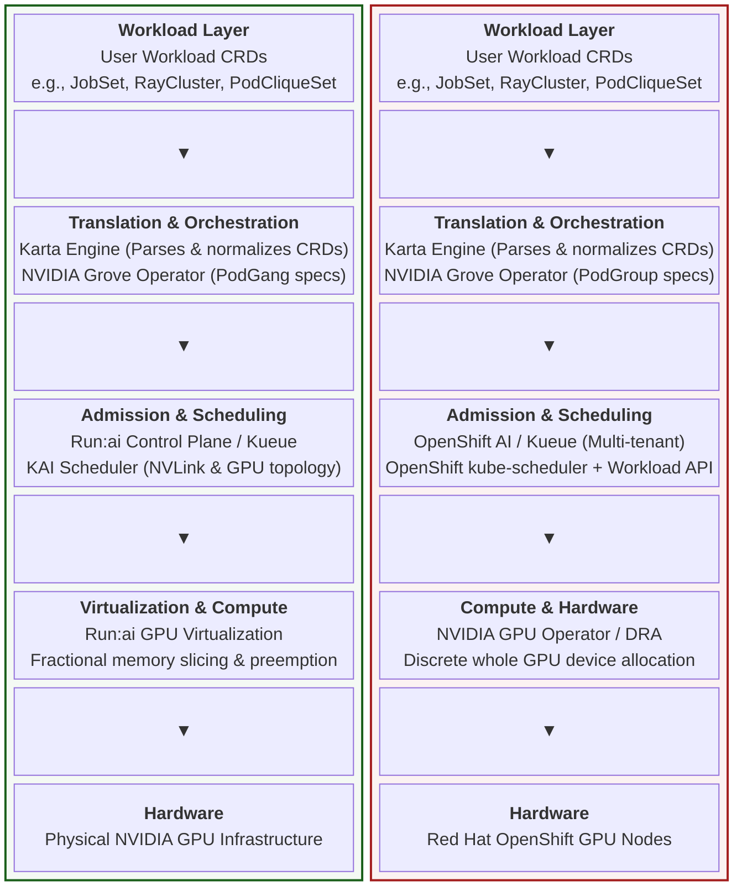

# Alternatives to the Karta Run:ai Stack

**Helm demo:** Karta + Grove + OpenShift **Workload API** (+ Kueue) — **no KAI**.

**Presentation:** open [`presentation/index.html`](presentation/index.html) (speaker notes with `?`). Overview: [`presentation/README.md`](presentation/README.md).

**Hands-on lab:** follow [karta-openshift-workload-api-runthrough.md](karta-openshift-workload-api-runthrough.md) for a beginner step-by-step deploy (what each step verifies and showcases).

**Verbose script:** from this directory run [`scripts/runthrough.sh`](scripts/runthrough.sh) (prints commands, checks, and pauses). Skip pauses with `INTERACTIVE=0`; skip operator reinstall with `SKIP_OPERATORS=1`.

This chart answers a roadmap question in plain English:

> Because of work on the **OpenShift / Kubernetes Workload API**, can we get away from the **KAI Scheduler** by combining **Karta**, **Grove**, and the native Workload API?

**Short answer: yes.** Combining **Karta**, **Grove**, and OpenShift’s native **Workload API** creates a streamlined AI stack that eliminates the need to run a secondary scheduler binary like KAI altogether.

> [!IMPORTANT]
> Combining **Karta**, **Grove**, and OpenShift's native **Workload API** creates a streamlined AI stack that eliminates the need to run a secondary scheduler binary like KAI altogether.

This chart does **not** install operators (or KAI). Run [`scripts/install-operators.sh`](scripts/install-operators.sh) first. Fractional GPU options are documented in [`fractional-gpus.md`](fractional-gpus.md).

Sibling demos: [`karta-decoupled-scheduler`](../karta-decoupled-scheduler) (Karta without KAI), [`karta-grove-kueue`](../karta-grove-kueue) (Grove + Kueue coexistence), [`karta-kueue-dra`](../karta-kueue-dra) (Kueue + DRA).

---

## Run:ai stack vs OpenShift AI path

Same workload and translation layers; different admission, placement, and compute.




| Layer       | Run:ai / NVIDIA                     | This OpenShift example                                              |
| ----------- | ----------------------------------- | ------------------------------------------------------------------- |
| Workload    | JobSet, RayCluster, PodCliqueSet, … | Same CRDs (demo: Grove PCS + batch Job)                             |
| Translation | Karta + Grove                       | **Karta** maps + **Grove** cliques                                  |
| Admission   | Run:ai CP / Kueue                   | **Kueue** (multi-tenant quota)                                      |
| Placement   | **KAI** (topology / PodGang)        | **kube-scheduler + Workload API**                                   |
| Compute     | Run:ai fractional VRAM / swap       | GPU Operator / DRA (+ [fractional workarounds](fractional-gpus.md)) |


---

## What each piece does here


| Piece              | Role                                                             | Replaces?                                                            |
| ------------------ | ---------------------------------------------------------------- | -------------------------------------------------------------------- |
| **Karta**          | Declarative map: where pods / claims / suspend live on a CRD     | Custom Go per CRD — **not** a scheduler                              |
| **Grove**          | Multi-pod clique topology (`PodCliqueSet`)                       | Application shape — **not** KAI                                      |
| **Kueue**          | Admit / queue against ClusterQueue quota                         | Run:ai admission control for multi-tenant fairness                   |
| **Workload API**   | Native `scheduling.k8s.io` Workload + gang `PodGroup` templates  | **KAI** as the secondary scheduler binary                            |
| **kube-scheduler** | Default OpenShift placement (`schedulerName: default-scheduler`) | KAI topology engine (advanced NVLink placement still optional later) |


```
Your app YAML (Job, Grove PodCliqueSet, …)
        │
        ▼
   Karta map ────────── “where are the pods / claims / suspend?”
        │
        ├──► Kueue ──── “may this start under quota?”          (admission)
        │
        └──► Grove ─── clique shape
                 │
                 └──► kube-scheduler + Workload API
                      “gang / which node?”                    (placement)

KAI ─────────── not installed — Workload API owns gang contract
```

**One-line takeaway:** Karta translates schema, Grove shapes cliques, Kueue admits, Workload API + kube-scheduler place — **KAI is optional, not required**.

---

## What this chart builds

1. **Karta** maps for Grove `PodCliqueSet` and `batch/v1` Job.
2. A minimal **Grove** `PodCliqueSet` pinned to `default-scheduler` (no KAI profile).
3. **Kueue** ResourceFlavor / ClusterQueue / LocalQueue (incl. logical `nvidia.com/gpu` quota).
4. A native **Workload** CR (`scheduling.k8s.io`) with gang `minCount`.
5. A suspended **gang Job** queued by Kueue, annotated for the Workload API contract.
6. Optional **time-slicing** samples (off by default) — see [`fractional-gpus.md`](fractional-gpus.md).

## File guide


| File                                                                             | What it is                                                            |
| -------------------------------------------------------------------------------- | --------------------------------------------------------------------- |
| [`Chart.yaml`](Chart.yaml)                                                       | Helm metadata                                                         |
| [`values.yaml`](values.yaml)                                                     | Toggles for Karta, Grove, Kueue, Workload API, fractional GPU samples |
| [`fractional-gpus.md`](fractional-gpus.md)                                       | Time-slicing, MIG, Dynamic Accelerator Slicer                         |
| [`presentation/`](presentation/)                                                 | HTML slideshow (bypass KAI, stacks, fractional GPUs)                  |
| [`templates/karta-podcliqueset.yaml`](templates/karta-podcliqueset.yaml)         | Karta map for Grove                                                   |
| [`templates/karta-batch-job.yaml`](templates/karta-batch-job.yaml)               | Karta map for Job                                                     |
| [`templates/grove-podcliqueset.yaml`](templates/grove-podcliqueset.yaml)         | Grove PCS on default-scheduler                                        |
| [`templates/kueue-*.yaml`](templates/)                                           | Quota / queue objects                                                 |
| [`templates/workload-api.yaml`](templates/workload-api.yaml)                     | Native Workload (gang)                                                |
| [`templates/sample-gang-job.yaml`](templates/sample-gang-job.yaml)               | Job → Kueue + Workload hints                                          |
| [`templates/fractional-gpu-samples.yaml`](templates/fractional-gpu-samples.yaml) | Opt-in time-slice ClusterPolicy / Pod                                 |
| [`templates/_helpers.tpl`](templates/_helpers.tpl)                               | Shared Helm helpers (fullname, labels)                                   |
| [`templates/NOTES.txt`](templates/NOTES.txt)                                     | Post-install `oc` checks                                              |
| [`scripts/install-operators.sh`](scripts/install-operators.sh)                   | Karta + Grove + Kueue only (**never KAI**)                            |
| [`scripts/grove-values.yaml`](scripts/grove-values.yaml)                         | Grove: `default-scheduler` profile only                               |


---

## Prerequisites

- OpenShift or Kubernetes cluster
- `helm` and `oc` (or `kubectl`)
- Cluster-admin to install operators and cluster-scoped CRs
- **Workload API (optional but intended):** `GenericWorkload` feature gate (+ `GangScheduling` for all-or-nothing). Check with:
  ```bash
  oc get crd workloads.scheduling.k8s.io
  ```
  If the CRD is missing, set `workloadApi.workload.enabled=false` (keep `gangJob.enabled=true`) so the Kueue-labeled Job still installs while skipping the native Workload CR.

## 1. Install operators (no KAI)

```bash
./scripts/install-operators.sh
```

Manual equivalent:

```bash
# Karta — schema engine only (chart still at run-ai GHCR)
helm upgrade --install karta oci://ghcr.io/run-ai/karta/karta \
  --version 0.2.0 -n karta-system --create-namespace --wait --timeout 5m \
  --set podSecurityContext.runAsUser=null \
  --set podSecurityContext.runAsGroup=null \
  --set resources.requests.memory=128Mi \
  --set resources.limits.memory=512Mi

# Grove — default-scheduler only (avoids crash if kai/volcano CRDs are absent)
helm upgrade --install grove-operator oci://ghcr.io/ai-dynamo/grove/grove-charts \
  --version v0.1.0-alpha.10-rc1 -n grove-system --create-namespace --wait \
  -f scripts/grove-values.yaml

# Kueue — admission
helm upgrade --install kueue oci://registry.k8s.io/kueue/charts/kueue \
  --version 0.19.5 -n kueue-system --create-namespace --wait
```

Override pins with `KARTA_CHART`, `KARTA_VERSION`, `GROVE_VERSION`, or `KUEUE_VERSION`.

## 2. Install this example

From the repo root (`run-ai-karta`):

```bash
helm upgrade --install demo ./examples/karta-openshift-workload-api \
  -n demo --create-namespace
```

If Workload API CRDs are absent:

```bash
helm upgrade --install demo ./examples/karta-openshift-workload-api \
  -n demo --create-namespace \
  --set workloadApi.workload.enabled=false
```

## 3. Verify

```bash
# Schema maps
oc get karta
# openshift-ai-grove-podcliqueset-v1alpha1
# openshift-ai-batch-job-v1

# Grove on default-scheduler (no KAI)
oc get podcliqueset -n demo
oc get pods -n demo -o jsonpath='{range .items[*]}{.metadata.name}{"\t"}{.spec.schedulerName}{"\n"}{end}'

# Kueue admission
oc get clusterqueue openshift-ai-cluster-queue
oc get localqueue -n demo
oc get workloads.kueue.x-k8s.io -n demo
oc get jobs -n demo

# Native Workload API (gang replacement for KAI)
oc get workloads.scheduling.k8s.io -n demo
```

Confirm **no KAI** in the path:

```bash
oc get pods -A | grep -i kai || echo "no KAI pods — expected"
```

---

## Workload API notes (OpenShift)

Upstream docs: [Workload API](https://kubernetes.io/docs/concepts/workloads/workload-api/), [Gang scheduling](https://kubernetes.io/docs/concepts/scheduling-eviction/gang-scheduling/), [CompositePodGroup / KEP-6012](https://kubernetes.io/docs/concepts/workloads/compositepodgroup-api/).

This demo creates an explicit `Workload` CR and annotates the Job. On clusters with `WorkloadWithJob`, the Job controller can compile `.spec.scheduling` into Workload / PodGroup objects for you — see comments in [`templates/sample-gang-job.yaml`](templates/sample-gang-job.yaml).

Karta’s `optimizationInstructions.gangScheduling.podGroups` stays the **portable hierarchy language**; the OpenShift path retargets consumers to **Workload API / CompositePodGroup**, not KAI PodGroups.

---

## Fractional GPUs without Run:ai

Run:ai’s differentiator is dynamic fractional VRAM + swap. OpenShift approximates via **time-slicing**, **MIG**, and **Dynamic Accelerator Slicer**. Full detail and YAML: [`fractional-gpus.md`](fractional-gpus.md).

Opt-in time-slice sample:

```bash
helm upgrade --install demo ./examples/karta-openshift-workload-api \
  -n demo --reuse-values \
  --set fractionalGpu.timeSlicing.enabled=true \
  --set fractionalGpu.inferencePod.enabled=true
```

---

## Teardown

```bash
./scripts/uninstall.sh
# FORCE=1 ./scripts/uninstall.sh
# KEEP_OPERATORS=0 ./scripts/uninstall.sh   # also remove Karta/Grove/Kueue
```

Or manually:

```bash
helm uninstall demo -n demo
# Operators (optional):
helm uninstall karta -n karta-system
helm uninstall grove-operator -n grove-system
helm uninstall kueue -n kueue-system
```

### Cross-demo Helm ownership

Karta maps, ClusterQueues, and ResourceFlavors are **cluster-scoped**. Each example uses **chart-prefixed** default names (e.g. `openshift-ai-batch-job-v1`) so releases can coexist. If you override names and collide with another release, Helm fails with `meta.helm.sh/release-name` must equal … — uninstall the owning release or pick unique `--set` names.

---

## Takeaways

1. **Bypassing KAI is viable** — Karta + Grove + Workload API + Kueue cover schema, topology, gang placement, and admission.
2. **No hard code dependency on KAI** — Grove and sample pods use `default-scheduler`; install script never pulls KAI.
3. **Fractional GPU gap** — use time-slicing / MIG / Dynamic Accelerator Slicer (see [`fractional-gpus.md`](fractional-gpus.md)); they are not a full substitute for Run:ai VRAM↔RAM swap.
4. Prefer aligning long-term with **KEP-6012 CompositePodGroup** + Kueue rather than treating Run:ai Karta as a hard product binary dependency — keep the **translation pattern**.

See. [https://github.com/kubernetes/enhancements/issues/6012](https://github.com/kubernetes/enhancements/issues/6012)