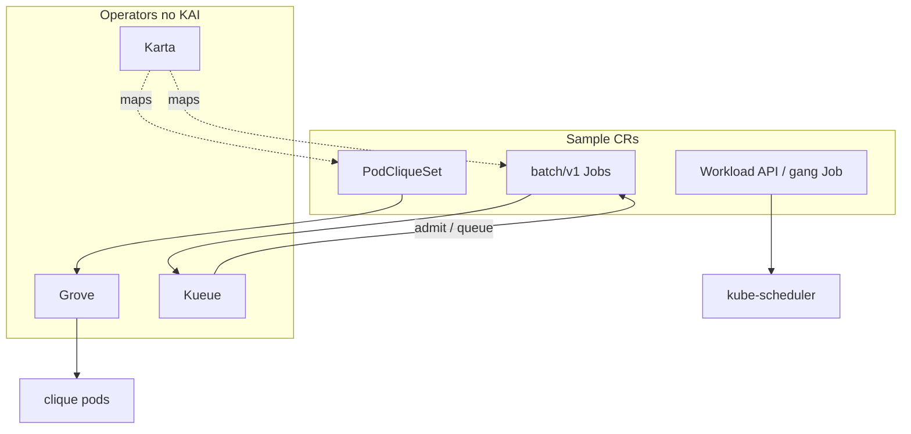
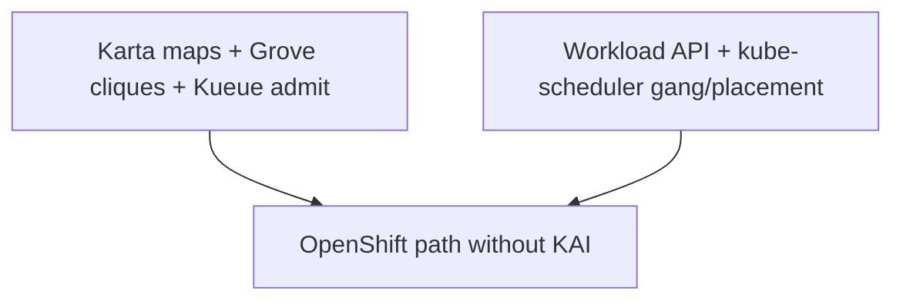

# Hands-on lab: OpenShift Workload API path (bypass KAI)

**Why this lab exists:** show OpenShift can run Karta + Grove + Kueue without KAI, using the native Workload API for gang contracts when available.

This is a **step-by-step runthrough**. Paste the commands, check the expected result, then read what that step proves.

**Or run the verbose script** (opening banner + per-section “why / what you should see”):

```bash
./scripts/runthrough.sh
# INTERACTIVE=0 ./scripts/runthrough.sh
# SKIP_OPERATORS=1 ./scripts/runthrough.sh
```

Commands use `oc` (OpenShift); swap for `kubectl` if needed. See [README.md](README.md). Fractional GPUs: [fractional-gpus.md](fractional-gpus.md).

---

## What you will prove today

1. **Karta + Grove + Kueue** run on OpenShift **without KAI**.
2. The native **Workload API** (`scheduling.k8s.io`) can carry gang / group scheduling contracts that KAI would otherwise own.
3. **Karta** still maps Grove `PodCliqueSet` and `batch/v1` Job — translation is not a scheduler.

---

## Tiny vocabulary

| Word | Plain meaning |
|------|----------------|
| **Workload API** | Native kube/OpenShift Workload + gang PodGroup templates |
| **Grove** | Multi-pod clique topology |
| **Kueue** | Multi-tenant admission / quota |
| **KAI** | Secondary GPU scheduler — **not installed** |

---

## Setup and flow

OpenShift path without KAI: Karta maps compound CRDs, Grove runs cliques, Kueue admits Jobs, and the Workload API / gang Job path covers gang-style scheduling on kube-scheduler.



---

## Before you start

```bash
cd examples/karta-openshift-workload-api
pwd
```

**Workload API check (optional but intended):**

```bash
oc get crd workloads.scheduling.k8s.io
```

If the CRD is missing, the rest of the demo (Karta / Grove / Kueue / gang Job) still runs. Install with `--set workloadApi.workload.enabled=false` (keep `gangJob.enabled=true`), or expect the Workload object to fail while other objects succeed. The script detects this and warns.

---

## Step 0 — Cluster access

```bash
oc whoami
oc get nodes
```

---

## Step 1 — Install operators (**no KAI**)

```bash
./scripts/install-operators.sh
```

Installs **Karta**, **Grove** (`default-scheduler` only), and **Kueue**. Never installs KAI.

```bash
oc get pods -n karta-system
oc get pods -n grove-system
oc get pods -n kueue-system
oc get pods -A | grep -i kai || echo "no KAI pods — expected"
```

---

## Step 2 — (Optional) Dry-run

```bash
helm template demo . | head -80
```

---

## Step 3 — Install this demo chart

```bash
helm upgrade --install demo . \
  -n demo --create-namespace
```

If Workload API CRDs are absent:

```bash
helm upgrade --install demo . \
  -n demo --create-namespace \
  --set workloadApi.workload.enabled=false
```

From repo root:

```bash
helm upgrade --install demo ./examples/karta-openshift-workload-api \
  -n demo --create-namespace
```

---

## Step 4 — Inventory

```bash
oc get karta
oc get podcliqueset -n demo
oc get clusterqueue openshift-ai-cluster-queue
oc get localqueue -n demo
oc get jobs -n demo
oc get workloads.scheduling.k8s.io -n demo 2>/dev/null || echo "Workload API CR missing or disabled"
oc get workloads.kueue.x-k8s.io -n demo
```

**Expected objects (when fully enabled):**

| Object | Role |
|--------|------|
| `openshift-ai-grove-podcliqueset-v1alpha1`, `openshift-ai-batch-job-v1` | Karta maps |
| `grove-openshift-demo` | Grove PCS on default-scheduler |
| `openshift-ai-cluster-queue` / `openshift-ai-queue` | Kueue admission |
| `gang-training-workload` | Native Workload (gang) |
| `gang-training-job` | Job → Kueue + Workload hints |

---

## Step 5 — Grove on default-scheduler (no KAI)

```bash
oc get podcliqueset -n demo
oc get pods -n demo -o jsonpath='{range .items[*]}{.metadata.name}{"\t"}{.spec.schedulerName}{"\n"}{end}'
```

**Expected:** Empty or `default-scheduler` — never `kai-scheduler`.

**This shows:** Grove topology does not require KAI.

---

## Step 6 — Kueue admission

```bash
oc get workloads.kueue.x-k8s.io -n demo
oc get jobs -n demo
oc get localqueue -n demo
```

**This shows:** Multi-tenant quota path on the OpenShift AI stack (not Run:ai CP / KAI).

---

## Step 7 — Workload API (gang replacement for KAI)

```bash
oc get workloads.scheduling.k8s.io -n demo -o yaml
oc get job gang-training-job -n demo -o yaml | head -80
```

**Expected (when CRD present):** Workload with gang `minCount`; Job annotated / labeled for the contract.

**This shows:** Placement gang semantics can sit on **Workload API + kube-scheduler**, not a secondary KAI binary.

---

## Step 8 — Karta maps (translation still needed)

```bash
oc get karta openshift-ai-grove-podcliqueset-v1alpha1 -o yaml | head -50
oc get karta openshift-ai-batch-job-v1 -o yaml | head -50
```

**This shows:** Bypassing KAI does **not** remove the need for a portable CRD→structure map.

---

## Step 9 — Clean up

```bash
helm uninstall demo -n demo
```

Optional operators:

```bash
helm uninstall kueue -n kueue-system
helm uninstall grove-operator -n grove-system
helm uninstall karta -n karta-system
```

---

## What you just saw



**Takeaway:** Combining Karta, Grove, and OpenShift’s native Workload API creates a streamlined AI stack that eliminates the need to run a secondary scheduler like KAI. Fractional GPU options (time-slicing / MIG / DAS) are documented separately — they are not a full Run:ai VRAM-swap substitute.

---

## Troubleshooting

| Symptom | What to try |
|---------|-------------|
| `workloads.scheduling.k8s.io` unknown | Feature gates / OpenShift version; `--set workloadApi.workload.enabled=false` (keep gang Job) |
| Grove scheduler crash | Confirm `scripts/grove-values.yaml` (default-scheduler only) |
| KAI pods appear | Unrelated install; demo path still uses default-scheduler |
| Helm: Karta / ResourceFlavor `exists and cannot be imported` / `meta.helm.sh/release-name` mismatch | Cluster-scoped objects from another example release. Defaults are chart-prefixed (`openshift-ai-*`). Uninstall the other release (`helm uninstall <release> -n <ns>`) or override names with `--set karta.batchJob.name=...`. Do **not** delete a Karta owned by another live release unless you intend to remove that demo. |

---

## Next reading

- [README.md](README.md) — Run:ai vs OpenShift stack diagram
- [fractional-gpus.md](fractional-gpus.md) — time-slicing / MIG / Dynamic Accelerator Slicer
- Sibling: [`../karta-decoupled-scheduler`](../karta-decoupled-scheduler) — Karta without KAI on PyTorchJob
