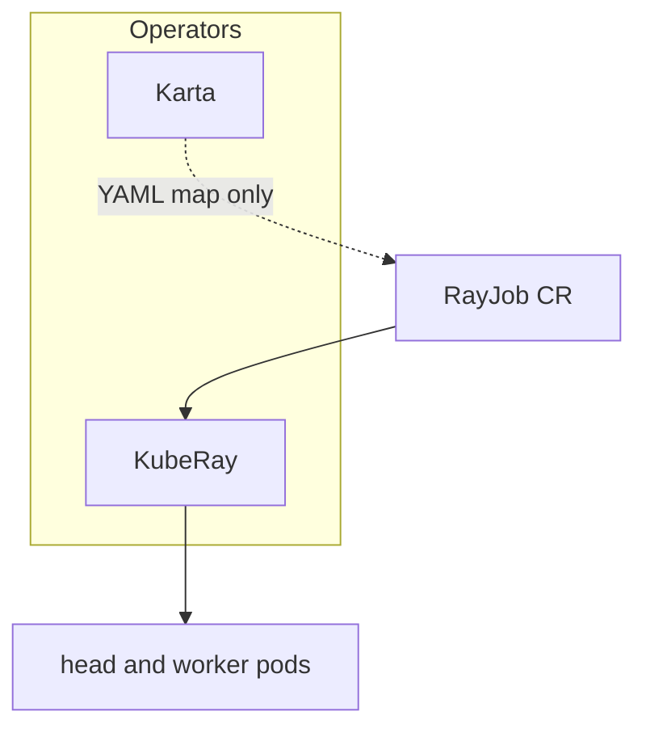
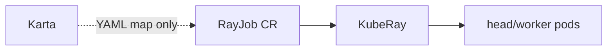

# Hands-on lab: Karta maps a RayJob (zero Go)

**Why this lab exists:** show that Karta can map a compound `RayJob` in YAML alone — without custom Go, Grove, or KAI.

This is a **step-by-step runthrough**. Paste the commands, check the expected result, then read what that step proves.

**Or run the verbose script** (opening banner + per-section “why / what you should see”, pauses between sections):

```bash
./scripts/runthrough.sh
# INTERACTIVE=0 ./scripts/runthrough.sh          # no Enter pauses
# SKIP_OPERATORS=1 ./scripts/runthrough.sh       # only if Karta + KubeRay already Running
```

Commands below use `oc` (OpenShift). Swap for `kubectl` on plain Kubernetes.

For deeper theory, see [README.md](README.md).

---

## What you will prove today

1. **Karta** is a YAML map of `ray.io/v1 RayJob` (head/worker paths, status mappings) — **no custom Go**.
2. **KubeRay** still owns RayJob lifecycle (creates pods). Karta does not replace it.
3. **Grove** and **KAI** are **not required** for the map to exist or for Ray to run on the default scheduler.

---

## Tiny vocabulary

| Word | Plain meaning |
|------|----------------|
| **RayJob** | KubeRay CR: run a Ray job with head + worker pod templates |
| **Karta** | Declarative schema map for compound CRDs |
| **KubeRay** | Operator that reconciles RayJob / RayCluster |

---

## Setup and flow

Karta adds a YAML-only schema map for `RayJob`. KubeRay still creates head/worker pods. No KAI or Grove required.



---

## Before you start

```bash
cd examples/karta-rayjob-compound-crd
pwd   # should end with .../karta-rayjob-compound-crd
```

**You need:** cluster, `helm`, `oc`/`kubectl`, cluster-admin.

**Honest expectations:** The sample RayJob is CPU-only and short-lived. Pods need enough CPU/memory; without GPU nodes that is fine. Image pull can take a few minutes the first time.

---

## Step 0 — Cluster access

```bash
oc whoami
oc get nodes
```

---

## Step 1 — Install Karta and KubeRay

```bash
./scripts/install-operators.sh
```

Installs **Karta** (`karta-system`) and **KubeRay** (default `ray-system`, or reuses an existing `kuberay-operator` anywhere). Does **not** install Grove or KAI.

Confirm:

```bash
oc get crd rayjobs.ray.io
oc get deploy -n karta-system
oc get deploy -A | grep -iE 'kuberay|ray-operator'
```

**This shows:** Map platform + Ray operator are up; optional layers stay optional.

---

## Step 2 — (Optional) Dry-run

```bash
helm template ray-demo . | head -80
```

---

## Step 3 — Install this demo chart

```bash
helm upgrade --install ray-demo . \
  -n ray-demo --create-namespace
```

From repo root:

```bash
helm upgrade --install ray-demo ./examples/karta-rayjob-compound-crd \
  -n ray-demo --create-namespace
```

---

## Step 4 — Inventory

```bash
oc get karta compound-ray-io-rayjob-v1
oc get rayjob -n ray-demo
oc get pods -n ray-demo
```

**Expected:** Karta `compound-ray-io-rayjob-v1`; RayJob `rayjob-compound-demo`; head/worker pods appear as KubeRay reconciles.

---

## Step 5 — Inspect the zero-Go map (the point of this demo)

```bash
oc get karta compound-ray-io-rayjob-v1 -o yaml
```

Spot JQ-style paths (replace hard-coded Go structs):

```bash
oc get karta compound-ray-io-rayjob-v1 -o jsonpath='{.spec.structureDefinition.childComponents[*].specDefinition.podTemplateSpecPath}{"\n"}'
```

**Expected:** Paths into head and worker templates, e.g.:

- `.spec.rayClusterSpec.headGroupSpec.template`
- `.spec.rayClusterSpec.workerGroupSpecs[].template`

Status mappings (optional pretty-print):

```bash
oc get karta compound-ray-io-rayjob-v1 -o jsonpath='{.spec.structureDefinition.rootComponent.statusDefinition.statusMappings}' | python3 -m json.tool
```

**This shows:** Onboarding Ray for platform visibility is a **Karta YAML**, not a new operator fork.

---

## Step 6 — Workload still runs under KubeRay + default scheduler

```bash
oc get rayjob -n ray-demo
oc get pods -n ray-demo -o wide
oc get pods -n ray-demo -o jsonpath='{range .items[*]}{.metadata.name}{"\t"}{.spec.schedulerName}{"\n"}{end}'
```

**Expected:** Scheduler empty or `default-scheduler` — not `kai-scheduler`. KubeRay creates pods; Karta only describes structure.

---

## Step 7 — Clean up

```bash
helm uninstall ray-demo -n ray-demo
```

Optional:

```bash
helm uninstall kuberay-operator -n ray-system
helm uninstall karta -n karta-system
```

---

## What you just saw



**Takeaway:** Karta adds schema translation atop frameworks like Ray. Grove/KAI remain optional consumers — not prerequisites for the map.

---

## Troubleshooting

| Symptom | What to try |
|---------|-------------|
| RayJob pods ImagePullBackOff | Wait / check registry access for `rayproject/ray` |
| No `rayjobs.ray.io` CRD | Re-run `install-operators.sh` |
| OpenShift SCC errors | Chart defaults `openshiftRestricted: true`; adjust image/SCC if needed |

---

## Next reading

- [README.md](README.md) — Jira framing, stakeholder talking points
- Sibling: [`../karta-kueue-admission`](../karta-kueue-admission) — same RayJob map + Kueue GPU quota
